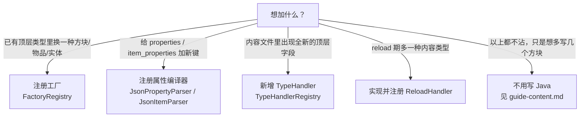

# 扩展指南：写 Java 才能做到的事（How-to）

> 面向要给数据驱动加能力的模组开发者。读者需要先有一条能跑通的路径（见 `intro.md`）和基本的 JSON 格式认知（见 `schema.md`）。
> 本文只覆盖**必须落到 Java** 的扩展点，每一节按「目标 → 代码 → 为什么」组织：新增顶层类型、内嵌类型、注册工厂、扩展属性解析、接入诊断、新增 reload 内容类型，以及怎么写测试。
> 边界：逐条查类与方法签名看 `api.md`；纯 JSON 就能表达的内容组织（分组、方块、物品、索引写法、属性速查）看 `guide-content.md`；字段级 JSON 规则与 D1–D6 看 `schema.md`。本文不重复签名表，也不重复 JSON 字段规则。
>
> 版本基准：Minecraft 1.21.1 / NeoForge 21.1.203 / mojmap + Parchment 2024.11.17 / Java 21。文中行号对应当前工作树（未提交的 data-driven 重实现）里的文件内容，基准 commit `ec864a1`，签名以 `api.md` 为准。

## 0. 先判断：这件事是否需要写 Java

数据驱动有两个扩展面：JSON 内容，和 JSON 认不出的能力。后者才需要写 Java。按下面这张表对号入座：



| 你的目标 | 扩展点 | 产物是否需要进 Minecraft 注册表 | 本文位置 |
|---|---|---|---|
| `"type": "my_door"` 能造出方块 | `FactoryRegistry.register` | 是 | §3 |
| `"type": "my_material"` 能造出物品 | `FactoryRegistry.registerItem` | 是 | §3 |
| `"type": "my_be"` 能挂方块实体 | `FactoryRegistry.registerBlockEntity` | 是 | §3 |
| 自定义非 MC 注册表对象（效果、定义等） | `FactoryRegistry.registerGeneric` + 自定义 `TypeHandler` | 否 | §1、§3 |
| `properties` 里出现 `mymod:my_key` | `JsonPropertyParser.registerCompiler` | — | §4 |
| 内容文件顶层出现 `"my_things": [...]` | 实现并注册 `TypeHandler` | 视定义而定 | §1 |
| 方块里内嵌 `"my_attach": {...}` | 内嵌型 `TypeHandler` | — | §2 |
| reload 后多读一种 `"xxx": [...]` 文件 | 实现并注册 `ReloadHandler` | — | §6 |
| 把扩展的失败暴露给运维/测试 | `Diagnostics` / `JsonTreeBuilder.addLoadingError` | — | §5 |

> 本文举例用的工厂类 `DataDrivenTestFactories` 与 `FanDataDrivenFactories` 都位于各模块的 `contentTesting` 源集。这类内容**以 mod 身份在测试运行时加载，但不进发布 jar**；真实模组要把工厂放进自己的 `src/main/java`。见 §8。

## 1. 新增一种顶层类型（TypeHandler）

### 1.1 目标

让内容文件里能出现一个新顶层字段，例如 `"my_definitions": [ {...}, {...} ]`，由你的 Java 代码解释它。系统按顶层字段名把数组分派给对应的 `TypeHandler`：注册期由 `JsonTreeBuilder.dispatchContent` 遍历 `TypeHandlerRegistry.all()` 完成（`JsonTreeBuilder.java:492-513`），字段名即 `getTypeName()`。

### 1.2 先选形态

两种写法，先决定走哪一种：

- **要产出 `Reg`（进 MC 注册表）**：继承 `RegTypeHandler<T>`（`handler/RegTypeHandler.java:15`）。它固化了「拆 id → 取工厂 → 挂命名空间/分组/创造标签 → 存入 context」的模板（`RegTypeHandler.apply:63-112`），你只需实现两个抽象方法。`blocks` / `items` 就是这么写的。
- **不产出 `Reg`（纯数据定义，或经 `FactoryRegistry.registerGeneric` 拿到对象）**：直接实现 `TypeHandler<T>`（`TypeHandler.java:8`），在 `apply` 里自行处理。测试里的 `TestGenericFactory` 走的是这条（`TestGenericFactory.java:51-73`）。

### 1.3 骨架（Reg 型，从 `RegTypeHandler` 模板抽取）

下面的类可以直接编译（`EffectDef` 只是占位定义）。它的写法取自 `BlockTypeHandler`（`handler/BlockTypeHandler.java:16-64`），只把取工厂的那一步换成 Generic 工厂。为节省篇幅，本节之后的代码块省略 import，涉及的符号都会注明出处：

```java
package com.example.mymod.data;

import com.google.gson.JsonObject;
import lib.kasuga.registration.Reg;
import lib.kasuga.registration.data_driven.handler.RegTypeHandler;
import lib.kasuga.registration.factory.FactoryRegistry;

public final class EffectTypeHandler extends RegTypeHandler<EffectTypeHandler.EffectDef> {

    /** parse 的产物：一个不可变的定义对象。字段来自 JSON，不含任何副作用。 */
    public record EffectDef(String id, String type, JsonObject params) {}

    @Override
    public String getTypeName() { return "effects"; }   // 认领的顶层字段名

    @Override
    public int getPhase() { return PHASE_CONTENT; }     // 见 1.5

    @Override
    public EffectDef parse(JsonObject json) {
        return new EffectDef(
                json.get("id").getAsString(),
                json.get("type").getAsString(),
                json.has("params") ? json.getAsJsonObject("params") : null);
    }

    @Override
    protected String resolveRawId(EffectDef definition) { return definition.id(); }

    /** 诊断里显示的是 JSON 的 type 值（如 my_effect），不是顶层字段名 effects。 */
    @Override
    protected String resolveType(EffectDef definition) { return definition.type(); }

    @Override
    protected Reg<?, ?> createRegistration(EffectDef definition, String path) {
        FactoryRegistry.GenericFactory factory = FactoryRegistry.getGeneric(definition.type());
        if (factory == null) return null;    // 返回 null 即「没有工厂」，框架会 warn 并跳过（见 §3.4）
        return factory.create(path, definition.params());
    }
}
```

`path` 已经由模板从 id 里剥出，不含命名空间（`RegTypeHandler.resolvePath:43-46`），工厂里不要再拼 namespace。

纯数据型可以更短。它把定义存进 `BuildContext` 的元数据槽，供别的 handler 引用（`BuildContext.putMeta:22`）：

```java
public final class MyDefinitionHandler implements TypeHandler<MyDefinition> {

    @Override public String getTypeName() { return "my_definitions"; }
    @Override public int getPhase() { return PHASE_GROUPS; }   // 被别的内容引用，所以先应用

    @Override public MyDefinition parse(JsonObject json) {
        return new MyDefinition(json.get("id").getAsString());
    }

    @Override public void apply(MyDefinition definition, BuildContext context) {
        context.putMeta(getTypeName(), definition.id(), definition);
    }

    /** 非 null 才参与重复 id 去重；默认返回 null 表示退出去重。 */
    @Override public String resolveIdentity(String modId, MyDefinition definition) {
        return definition.id();
    }
}
```

### 1.4 parse 与 apply 怎么分工

- `parse(JsonObject)` 拿数组里的一个 JSON 对象，返回你的定义对象。它应当**是纯函数**：不注册、不改全局状态、不依赖调用顺序。
- `apply(T, BuildContext)` 才执行注册。它按 `getPhase()` 分批、在**所有文件都 parse 完之后**调用（`JsonTreeBuilder.buildForMod:61`）。

这么切有两个具体理由：

1. **重复 id 在 apply 之前裁决。** 先 parse 全部条目，`resolveDuplicates` 用 `resolveIdentity` 判重，只有胜者进入 apply（`JsonTreeBuilder:119, 652`）。落败的条目**也被 parse 过**。所以 parse 里若有副作用，落败条目会带着副作用生效。
2. **同一份数据可能被多个文件/清单引用**，parse 是收集阶段，apply 是执行阶段。把两者分开，去重与诊断才能在一个「无副作用窗口」里完成。

### 1.5 选 phase

`apply` 不按文件顺序，而按 `getPhase()` 升序分批（`JsonTreeBuilder:119-121`）。三档常量的值定义在 `TypeHandler.java:11-17`：

| 常量 | 值 | 用途 | 参考实现 |
|---|---|---|---|
| `PHASE_GROUPS` | 0 | 先建、被后面引用的对象 | `RegistryGroupHandler`（`getPhase:23`） |
| `PHASE_CONTENT` | 1 | 常规内容（方块、物品） | `BlockTypeHandler`（`:22`）/ `ItemTypeHandler`（`:19`） |
| `PHASE_EMBEDDED` | 2 | 附着在父对象上的内嵌类型 | `BlockEntityTypeHandler`（`:24`） |

新类型绝大多数用 `PHASE_CONTENT`。如果它像分组那样会被后续内容按 id 查找，用 `PHASE_GROUPS`；如果它像方块实体那样必须落在父对象之后，用 `PHASE_EMBEDDED` 并配合 §2。

同 phase 内按注册顺序（`Comparator` 稳定排序），跨 phase 一定按值先后。所以「谁先谁后」不要靠猜文件顺序，而是通过 `getPhase` 或 `BuildContext` 查找来保证。

### 1.6 注册 handler

`TypeHandlerRegistry` 是一张全局静态表，用 `register` 写入、按 `getTypeName()` 索引（`TypeHandlerRegistry.java:11-17`）。内置四个 handler 由 `JsonTreeBuilder.ensureHandlersRegistered()` 惰性注册一次（`JsonTreeBuilder:49-56`），你的 handler 需要自己注册，并且要**早于**索引读取：

```java
@Context                                        // Micronaut 即刻初始化
public class MyModDataDriven {

    @PostConstruct
    public void init() {
        TypeHandlerRegistry.register(new EffectTypeHandler());
    }
}
```

`@Context` + `@PostConstruct` 的时机是安全的：读取索引的 `JsonTreeIntegration` 用惰性 `RegisterContextRegistry` 回调在启动分发时才调 `buildForMod`，晚于所有 `@Context` bean 的构造（见 `FanDataDrivenFactories.java:39-43` 对同一时机的说明）。如果注册晚了，框架找不到字段对应的 handler，该字段按「未知顶层字段」报错（`JsonTreeBuilder:475-490`）。

### 1.7 配套 JSON 与索引

字段名就是 `getTypeName()`，值必须是**数组**，每个元素是对象（`JsonTreeBuilder:500-506` 强制这两点）：

```json
{
  "effects": [
    { "id": "mymod:burn", "type": "my_effect", "params": { "duration": 600 } }
  ]
}
```

这个内容文件要被读到，还得由索引清单列出来。清单只有两个数组字段 `on_register` 与 `on_reload`；旧的 `sources` 字段已废弃，写了会被当成未知字段记录为加载错误（`schema.md` §1.3）。注册期内容放 `on_register`：

```json
{ "on_register": [ "mymod_content/effects.json" ] }
```

清单与内容文件的路径、语法、D1–D6 规则见 `schema.md` §1、§2；如何组织多个内容文件见 `guide-content.md`。清单位置固定在 `data/<mod_id>/kasuga_lib/data_driven/`（`JsonTreeBuilder.indexDirectorySegments:745-747`）。

### 1.8 去重 identity（可选）

`resolveIdentity(modId, definition)`（`TypeHandler.java:64`）返回一个字符串，表示「同一类型字段内这个定义的身份」。两条 identity 相等的定义算重复，**后写的胜出**（last-wins）。默认返回 `null`，表示这个类型永不参与去重。

- 继承 `RegTypeHandler` 时已自动实现：用 `EffectiveId` 把 id 归一化到实际命名空间，让 `"foo"` 与 `"minecraft:foo"` 正确相撞（`RegTypeHandler:58-60`）。
- 直接实现 `TypeHandler` 时自己覆写。若你的定义没有注册 id（例如一个纯效果列表），保持默认 `null` 即可，不要编一个假 id。
- identity 解析抛异常会被降级为「无身份」，条目不会被去重，也不会让加载崩溃（`JsonTreeBuilder.identityOf:691`）。

### 1.9 为什么这样设计

三档 phase 存在的原因很直接：一个内容文件可以同时声明分组和方块，而方块要挂到已存在的分组上；如果按文件顺序应用，先写方块就会失败。用 phase 把「谁必须先于谁」编码成声明，而不是让作者排列文件顺序。parse/apply 拆开则让去重与诊断在注册前完成，避免重复 id 真的写进注册表（`DuplicateIdResolver` 的类注释解释了为什么不能在注册器层兜底）。

## 2. 内嵌类型：挂在父条目里的类型

### 2.1 目标

有些内容依附在某个父对象上，而不是独立条目，例如 `block_entity` 写在方块里（modelling contentTesting 的 `fsm_blocks.json` 的 `block_entity.type`）。这类类型不占顶层字段，只能从父对象里抽出来。

### 2.2 三个方法的配合

覆写 `getParentTypeName`、`getEmbeddedKeyName`、`extractEmbedded`（`TypeHandler.java:38-50`）。下面的实现取自 `BlockEntityTypeHandler`（`handler/BlockEntityTypeHandler.java:27-53`），把 `block_entity` 换成了你想用的键：

```java
public final class AttachmentTypeHandler implements TypeHandler<AttachmentTypeHandler.AttachmentDef> {

    public record AttachmentDef(String type, String parentBlockId) {}

    @Override public String getTypeName() { return "attachments"; }  // 仅用于注册表索引
    @Override public int getPhase() { return PHASE_EMBEDDED; }       // 父对象之后应用
    @Override public String getParentTypeName() { return "blocks"; } // 寄居在 blocks 条目里
    @Override public String getEmbeddedKeyName() { return "attachment"; } // 父条目里的键名

    @Override
    public List<JsonObject> extractEmbedded(JsonObject blockJson) {
        if (!blockJson.has("attachment")) return null;      // 没有内嵌数据
        JsonObject attachment = blockJson.getAsJsonObject("attachment").deepCopy();
        attachment.addProperty("_parent_block", blockJson.get("id").getAsString());
        return List.of(attachment);
    }

    @Override
    public AttachmentDef parse(JsonObject json) {
        return new AttachmentDef(
                json.get("type").getAsString(),
                json.get("_parent_block").getAsString());
    }

    @Override
    public void apply(AttachmentDef definition, BuildContext baseContext) {
        RegBuildContext context = (RegBuildContext) baseContext;
        Reg<?, Block> blockReg = context.getBlockReg(definition.parentBlockId());
        if (blockReg == null) return;                        // 父方块不存在，跳过（可加 warn）
        // ... 用 blockReg 构造并挂上你的内嵌对象
    }
}
```

三个方法的契约：

- `getParentTypeName()` 非 null 即声明「我是内嵌类型」，值是父类型的 `getTypeName()`。
- `getEmbeddedKeyName()` 只用于诊断。当作者把内嵌类型误写成顶层字段时，报错消息会点名「应该写在 `<父类型>` 条目的 `<这个键>` 里」（`JsonTreeBuilder.dispatchContent:475-490`）。不覆写就少这一段提示（返回 `null`）。
- `extractEmbedded(JsonObject parentJson)` 拿到一个父条目，返回内嵌对象列表（0 个返回 `null`）。`_parent_block` 不是框架强制的字段名，是本仓 `BlockEntityTypeHandler` 用的约定；你可以自定义，只要自己的 `parse` 认这个键。

### 2.3 与顶层类型的差异

- 内嵌类型**不参与顶层字段分派**。`dispatchContent` 先把内嵌 handler 挑出去（`JsonTreeBuilder:461-467`），只对顶层 handler 检查 `root.has(getTypeName())`（`:500-506`）；内嵌数据在父对象的循环里单独抽取（`:528-535`）。
- 因此内嵌类型的 `getTypeName()` 在顶层字段里**不是合法字段**。顶层写 `"block_entities": [...]` 会走未知字段路径报错，并给出正确键名提示。

### 2.4 为什么误写顶层不会中止整个文件

未知顶层字段只记一条诊断然后继续处理其它字段（`JsonTreeBuilder:475-490` 的循环不 `throw`），同文件的合法字段照常 parse。这是有意的「半应用」语义：一个内嵌类型写错位置，不该让同一文件里正常的方块/物品一起丢掉。测试 `JsonTreeBuilderEmbeddedTypeDispatchTest.topLevelEmbeddedTypeIsReportedAndTheRestOfTheFileStillDispatches`（`:46-67`）同时锁住了「报一条错」和「兄弟字段仍然分发」。

一个父类型当前只能挂一个内嵌子类型：`TypeHandlerRegistry.findByParent` 是线性查找、返回第一个匹配（`TypeHandlerRegistry.java:23-30`）。

## 3. 注册工厂（FactoryRegistry）

### 3.1 目标与选型

`type` 是 JSON 与 Java 的接缝。一个工厂负责一类对象的构造。`FactoryRegistry` 提供四张独立的表，各有一个 `register*`/`get*`/`contains*`（`modules/core/.../factory/FactoryRegistry.java`）：

| 你的 JSON | 注册方法 | 工厂签名 | 取用方 |
|---|---|---|---|
| `blocks` 里的 `type` | `register(type, BlockFactory)`（`:44`） | `create(String id, @Nullable JsonObject params)`（`:18-20`） | `BlockTypeHandler.createRegistration:60-64` |
| `items` 里的 `type` | `registerItem(type, ItemFactory)`（`:58`） | `create(String id, @Nullable JsonObject params)`（`:23-25`） | `ItemTypeHandler.createRegistration:56-60` |
| `block_entity.type` | `registerBlockEntity(type, BlockEntityFactory)`（`:74`） | `create(String id, Supplier<Block[]> validBlocks, @Nullable JsonObject params)`（`:28-30`） | `BlockEntityTypeHandler.apply:92` |
| 自定义顶层类型 | `registerGeneric(type, GenericFactory)`（`:93`） | `create(String id, JsonObject params)`（`:33-35`） | 你的自定义 handler |

Generic 工厂的 `params` 没有 `@Nullable` 标注，实现里要么接受 null，要么自己判空。

### 3.2 bean 装配：`@Context` + `@PostConstruct`

工厂要在索引读取之前注册，所以放进 `@Context` bean 的 `@PostConstruct`。下面的写法取自 `FanDataDrivenFactories`（`modules/modelling/src/contentTesting/java/test/kasuga/modelling/FanDataDrivenFactories.java:45-115`）与 `DataDrivenTestFactories`（`modules/data-driven/src/contentTesting/java/test/kasuga/data_driven/DataDrivenTestFactories.java:21-55`）：

```java
@Context
public class MyModFactories {

    @PostConstruct
    public void init() {
        // 方块工厂：id 只含 path，namespace 已被 handler 剥掉
        FactoryRegistry.register("my_door", (id, params) -> blockWithItem(id, MyDoorBlock::new));

        // 同一工厂读 params 做变体
        FactoryRegistry.register("my_window", (id, params) -> {
            int height = params != null && params.has("height")
                    ? params.get("height").getAsInt() : 1;
            return blockWithItem(id, () -> new MyWindowBlock(height));
        });

        // 物品工厂
        FactoryRegistry.registerItem("my_material", (id, params) -> ItemReg.of(id, Item::new));

        // 方块实体工厂：validBlocks 是惰性 Supplier，存起来别当场 get()
        FactoryRegistry.registerBlockEntity("my_be", MyModFactories::createBeReg);
    }

    @SuppressWarnings("unchecked")
    private static <T extends Block> Reg<?, Block> blockWithItem(
            String id, Function<BlockBehaviour.Properties, T> blockSupplier) {
        return (Reg<?, Block>) (Reg<?, ?>) BlockReg.of(id, blockSupplier).withDefaultBlockItem(id);
    }

    private static Reg<?, ?> createBeReg(String id, Supplier<Block[]> validBlocks, JsonObject params) {
        BlockEntityReg<MyBlockEntity> reg = new BlockEntityReg<>(id,
                r -> (pos, state) -> new MyBlockEntity(r.getEntry(), pos, state));
        reg.withProperty(Collection.class,
                col -> { col.addAll(Arrays.asList(validBlocks.get())); return col; });
        return reg;
    }
}
```

符号出处：`BlockReg.of(...).withDefaultBlockItem(id)` 的用法见 `DataDrivenTestFactories.java:27` 与 `FanDataDrivenFactories.java:92`（`withDefaultBlockItem` 定义在 `BlockReg.java:108`）；`ItemReg.of` 见 `ItemReg.java:79`；`new BlockEntityReg<>(id, supplier)` 见 `BlockEntityReg.java:59`；`Reg.withProperty(Class, Function)` 见 `Reg.java:97`。

### 3.3 params 契约

`params` 是定义里 `params` 字段的原始 JSON 对象，可以是 `null`，语义**完全由工厂定义**。内置的 `fsm_be` 从 params 读 `state_machine` / `model` / `model_name`，并把读不到的情况降级成 warn 而不是抛异常（`FsmBlockEntityFactories.java:63-76`）。自定义工厂同样应该：缺参数就打 warn，让对象以退化形态存在，而不是让整个条目失败。

`BlockEntityFactory.validBlocks` 是 `Supplier<Block[]>`，惰性求值；工厂应把它存进 supplier，不要在 `create` 当时就 `get()`（`api.md` §10）。

### 3.4 缺工厂的行为：warn 跳过，不是报错

如果 JSON 的 `type` 没有对应工厂，`RegTypeHandler.createRegistration` 按约定返回 `null`，模板随即打一条 WARN 并 return（`RegTypeHandler.apply:70-74`）：

```java
Reg<?, ?> reg = createRegistration(definition, path);
if (reg == null) {
    LOGGER.warn("No factory for type '{}' (id '{}')", resolveType(definition), rawId);
    return;
}
```

这条 WARN **只进日志，不进诊断桶**（`api.md` §12 列在「只进日志」一栏）。原因是「工厂可能还没注册」是开发期常见状态，把它当加载错误会让桶噪声过大；但代价是——**缺工厂时该方块/物品会被静默跳过，运行时只看到一条 WARN**。排查「方块没出现」时先看这条日志。

内嵌的方块实体另有前置检查：父方块找不到或 BE 类型未知时，`BlockEntityTypeHandler.apply:75-86` 也是 warn 跳过。

### 3.5 为什么这样设计

工厂与 handler 分离，是因为同一个 `type`（例如 `my_door`）要由「谁创建」和「谁进哪个注册表」两件事共同决定，而不同的模组可能复用同一套 handler。工厂注册进全局静态表、用 `ConcurrentHashMap` 承载（`FactoryRegistry.java:37-40`），重复注册同一 `type` 静默覆盖（`FactoryRegistryTest.registerDuplicateOverwrites`）。这也意味着 `type` 名是全局共享的，建议带上模组前缀降低撞名概率。

## 4. 扩展属性解析

### 4.1 目标

让 `properties`（方块/分组）或 `item_properties`（物品/方块/分组）里出现自定义键。这一层只改「怎么把键编译成对 `Properties` 的修改函数」，不动内容文件的其它字段。

### 4.2 方块属性：`JsonPropertyParser.registerCompiler`

`JsonPropertyParser` 是单例（`INSTANCE:23` 或 `getInstance():217`）。两种注册方式：

```java
// 方式一：按 key 精确匹配（推荐）
JsonPropertyParser.getInstance().registerCompiler("mymod:hardness_per_axis", (key, value) -> {
    float hardness = value.getAsFloat();
    return props -> { props.strength(hardness); return props; };
});

// 方式二：自定义匹配逻辑
JsonPropertyParser.getInstance().registerCompiler(new PropertyCompiler(
        (key, value) -> key.startsWith("mymod:"),          // BiPredicate：这个键归我管吗？
        (key, value) -> props -> { props.strength(1.0F); return props; } // 编译为修改函数
));
```

签名见 `JsonPropertyParser.registerCompiler:197/201`，`PropertyCompiler` 构造见 `compiler/PropertyCompiler.java:16`。两种都会往编译器列表**末尾追加**（`addCompiler:187-190`）。

匹配规则：按列表顺序逐一试 `valid(key, value)`，**第一个命中生效**（`parseBlockProperty:44-49`）。内置键在前（`buildCompilers:148-174`），所以自定义编译器**无法覆盖内置键**——例如登记 `"strength"` 不会生效，因为内置的 `strength` 先命中。要么换一个带前缀的键名；内置项无法摘下，因为 `removeCompiler` 需要一个 `PropertyCompiler` 实例，而内置项的实例没有对外暴露（见 §10）。

未命中任何编译器时打 `Unknown block property: <key>` WARN 并忽略该键（`:50-52`）；值解析失败打 WARN 并返回 null（`:54-57`）。两者都不入诊断桶。

### 4.3 物品属性：`JsonItemParser.registerParser`

`JsonItemParser` 同样是单例（`INSTANCE:15`），键按**逐字匹配**（`Map<String, ItemPropertyParser>`，`registerParser:67`）：

```java
JsonItemParser.INSTANCE.registerParser("mymod:durability_bonus", (key, value) -> {
    int bonus = value.getAsInt();
    return props -> { props.durability(bonus); return props; };
});
```

`ItemPropertyParser` 是函数式接口 `parse(String, JsonElement) → Function<Item.Properties, Item.Properties>`（`JsonItemParser.java:71-74`）。注意两点：键**区分大小写**（与方块属性不同，方块侧经 `RLCompiler` 会小写归一化，`RLCompiler.java:17-23`）；`tab` 是保留键，parser 阶段直接跳过（`JsonItemParser.parseItemProperty:52`），由 handler 层翻译成创造标签页绑定，你的 parser 永远收不到它。

### 4.4 生命周期

两个解析器都是进程级单例，自定义编译器一旦注册就**长期存在**，跨 mod、跨 `/reload` 都不清（`clearCompilers` 是 `protected`，`JsonPropertyParser.java:205`）。所以：

- 用带模组命名空间的键名（`mymod:xxx`），降低与其它模组撞键的概率；方块属性用 `registerCompiler(String, ...)` 时键会被当成 ResourceLocation 解析，裸键会归到 `minecraft:` 命名空间下。
- 注册时机与工厂一致：`@Context` + `@PostConstruct`，早于内容解析。

### 4.5 为什么这样设计

属性被编译成 `Function<Properties, Properties>` 后，由 `Reg` 的 property 链按父先子后的顺序叠加（`Reg.applyProperties`，`Reg.java:103-110`），方块级最后应用因而优先级最高。这种「链式覆盖、整键替换」让分组可以给出默认值、方块级可以覆盖它，而不需要任何字段合并逻辑（详见 `api.md` §11.3）。

## 5. 接入诊断

### 5.1 两个维度，各管什么

`Diagnostics`（`diagnostics/Diagnostics.java`）是统一出口，错误地址分两维，互不混合：

| 维度 | 写入 | 读取 | 谁在用 |
|---|---|---|---|
| 按 mod id | `report(String modId, Throwable)`（`:64`） | `errors(modId)`（`:73`） | 注册域全部 |
| 按域 + source key | `report(Domain, String key, Throwable)`（`:96`） | `errors(Domain, key)`（`:107`） | reload 域用 `Domain.RELOAD_DATA`（键 = 命名空间）；assets / config 域仍预留 |

`report(modId, ...)` 逐字委托给 `JsonTreeBuilder.addLoadingError(modId, error)`（`JsonTreeBuilder:844`），读取端 `errors(modId)` 委托给 `getLoadingErrors(modId)`（`:806`）。所以「断言 `getLoadingErrors(modId)` 为空」这条既有契约不受门面影响（`DiagnosticsTest.modDimensionIsTheExistingBucket`）。

### 5.2 handler 报错该走哪条

扩展一个 handler 时，三种失败通道的后果不同：

| 你在哪抛 | 处理方 | 后果 |
|---|---|---|
| `apply` 里抛异常（且没被你自己 catch） | `JsonTreeBuilder.applyUnchecked:712` | ERROR 日志 + 记入该 mod 桶；**其余条目继续** |
| `parse` 里抛异常 | `JsonTreeBuilder` 注册期元素级容错 | 记入桶一条 `entry <i> in '<key>' failed to parse: <msg>; entry skipped`；**只丢该元素**，同文件兄弟条目照常 |
| 不抛，只 `LOGGER.warn` | 你自己 | 只留日志，桶里没有痕迹 |

因此约定是：**parse 要宽容**（缺字段给默认值，不要抛），因为解析期拿不到 context，产出的诊断不如 apply 期完整。真要放弃某个条目时，`parse` 抛出和 `apply` 抛出现在都只影响该条目本身，框架记账后继续跑后面的条目；`apply` 抛异常的诊断带类型名、mod id、原始 cause，信息更全，一般更值得选。测试 `JsonTreeBuilderLoadingErrorTest.failingHandlerApplyIsRecordedInTheBucket`（`:168-181`）锁住了 apply 抛异常会带类型名、mod id、原始 cause 进桶。

需要一条**不进桶**的软提示（例如「缺工厂」「可选参数缺失」）时，照 `RegTypeHandler.apply:70-74` 只打 WARN 即可，§3.4 已说明这是有意的降级。

如果确实要在桶里留一条非致命记录，可以直接调 `Diagnostics.report(context.getModId(), new IllegalStateException("..."))`：`apply` 拿得到 `BuildContext`，其 `getModId()` 可用（`BuildContext.java:17`）。注意 `parse` **拿不到** modId 或 context，所以解析期的软诊断只能在 apply 阶段补。这一点在 §10 列为设计不足。

### 5.3 一个容易踩的细节：`RegTypeHandler` 内部吞异常

自定义 handler 若继承 `RegTypeHandler`，模板方法 `apply` 自带 try/catch，捕获后只打 WARN 并 return（`RegTypeHandler.apply:107-111`）。这意味着**你在 `createRegistration` 或 `configureTypeSpecific` 里抛的异常不会到达 `applyUnchecked`，也就不会进桶**。若你希望失败被记入诊断桶，要么直接实现 `TypeHandler`（让异常逃出 `apply`），要么在该 catch 覆盖不到的层显式调用 `Diagnostics.report`。

### 5.4 reload 域走 domain 维（`Domain.RELOAD_DATA`）

reload 侧的错误通过 `ReloadOrchestrator.reportError`（`:566-573`）与各 handler 的 `reportError` / `reportWarning`（如 `FsmReloadHandler.java:118-130`）上报，两者都调 `Diagnostics.report(Domain.RELOAD_DATA, namespace, ...)`，其中 `namespace` 是出错文件所在的**命名空间**。也就是说 reload 错误落在**域/源键维**（`Domain.RELOAD_DATA`，键 = 命名空间），与注册期的 mod 维分开。两维在 `/kasuga_data errors` 的输出里用不同 label 区分（mod 维 `[<mod>] <error>`，reload 维 `[RELOAD_DATA[<命名空间>]] <error>`）；reload 维在每轮开头清空（`runCycle` 的 `Diagnostics.clear(Domain.RELOAD_DATA)`，`:208`），连续 `/reload` 不会累积。

`Diagnostics.Domain` 的四个常量与 `errorsBySource` 表都在，reload 域已写入 `RELOAD_DATA`（`Diagnostics.java:40-49, 55`）。新扩展按失败归属选维：按 mod 归属用 `report(modId, ...)`；「属于某个源而非某个 mod」的失败用 `report(Domain, key, ...)`。assets / config 域仍预留。

### 5.5 读侧

- 游戏内：`/kasuga_data errors [mod]`。无参打印每个非空桶一行汇总（`Diagnostics.summarize():143`），带 mod id 列出该 mod 的两维逐条失败（mod 维与 `RELOAD_DATA[<命名空间>]` 源维）。命令树定义在 `DataDiagnosticsCommands.kasugaDataCommand:45`，注册于 `onRegisterCommands:57`，需要权限等级 2。
- 测试：断言 `JsonTreeBuilder.getLoadingErrors(modId)` 为空，或用 `Diagnostics.errors(modId)`（等价）。
- 汇总行格式（`summarize`）：mod 桶为 `<mod>: N error(s)`，source 桶为 `<DOMAIN>[<key>]: N error(s)`，顺序确定，便于断言（`DiagnosticsTest.summarizePrintsOneLinePerNonEmptyBucketDeterministically`）。

## 6. 新增 reload 期内容类型

### 6.1 目标与前提

reload 期内容（`/reload` 时从包栈读取、可被数据包覆盖）由 `ReloadOrchestrator` 编排（`ReloadOrchestrator.java:121`）。编排器本身**不认识任何类型名**：它遍历 `ReloadHandlerRegistry`，把每个已注册 `ReloadHandler` 的 `typeName()` 当作合法顶层键，逐文件路由、去重、注册。所以要新增一种 reload 内容类型，你**实现并注册一个 `ReloadHandler`，不改任何框架类**。

接口对称于注册期的 `TypeHandler`：一个 `TypeHandler` 管一种注册类型的 parse/apply，一个 `ReloadHandler` 管一种 reload 类型的 decode/register。两者各自的注册表（`TypeHandlerRegistry` / `ReloadHandlerRegistry`）都由 data-driven 拥有，所以 data-driven **仍然不依赖 modelling**（见 §8 第 1 条）。

前提：**handler 的实现必须落在能 import data-driven 的模块**。`ReloadHandler` / `ReloadHandlerRegistry` / `Decoded` / `Reloaded` 都在 data-driven 的 `lib.kasuga.registration.data_driven.reload` 包；本仓的两个 FSM handler 放在 modelling（消费方模块），依赖方向仍是 modelling → data-driven。data-driven 侧只提供可复用的纯函数（`JsonTreeBuilder.parseIndexManifest` / `resolveIndexManifests` / `validateSourcePath`、`DuplicateIdResolver`）。

### 6.2 实现并注册一个 `ReloadHandler`

最短的例子是 `FsmClipsReloadHandler`（index-only、无跨类型校验）。照它的形状写：`typeName()` 认领顶层键，`decode` 纯解码，`register` 写自己的桶。下面的类演示接口的每个回调（`MyThing` / `MyThingCodec` / `MyBucket` 是作者自己的占位类型，不是框架 API；`bucket.clearResource()` / `registerResource(...)` 就是这个 handler 拥有的桶，仿 `FsmAnimationClips` 的 `clearResource` / `registerResource`）：

```java
package com.example.mymod.reload;

import com.google.gson.JsonObject;
import lib.kasuga.registration.data_driven.reload.Decoded;
import lib.kasuga.registration.data_driven.reload.ReloadHandler;

public final class MyThingsReloadHandler implements ReloadHandler<MyThing> {

    private final MyBucket bucket;

    public MyThingsReloadHandler(MyBucket bucket) { this.bucket = bucket; }

    @Override
    public String typeName() { return "my_things"; }        // 认领的顶层键，兼作去重碰撞空间

    @Override
    public String describeFile() { return "my thing file"; } // decode 诊断里的名词（默认 "reload-domain file"）

    @Override
    public void clearBucket() {
        bucket.clearResource();   // 只丢 reload 来源；脚本/代码注册的条目跨 reload 存活
    }

    @Override
    public Decoded<MyThing> decode(JsonObject root) {
        // 纯解码：不读文件（编排器负责 I/O），畸形内容作为 errors 返回而非抛异常。
        // 转调你自己的纯解码器，把条目包成 Decoded.Entry(id, payload)。
        return MyThingCodec.decode(root);
    }

    @Override
    public void register(MyThing payload) {
        bucket.registerResource(payload.id(), payload);  // last-wins 胜者在此落地
    }
}
```

`@Context` bean 在 `@PostConstruct` 里登记，时机与工厂/handler 一致（早于任何 reload）：

```java
@Context
public class MyModReloadHandlers {

    @PostConstruct
    public void init() {
        ReloadHandlerRegistry.register(new MyThingsReloadHandler(MyBucket.GLOBAL));
    }
}
```

`ReloadHandlerRegistry.register` 按 `typeName()` 索引、`LinkedHashMap` 保序：同名重复注册**原地替换、保留位置**，所以 bean 在测试里重跑是幂等的。**注册顺序有意义**——编排器按注册顺序决定 dispatch/register 顺序，也就决定跨类型 last-wins，以及哪个 handler 的 `afterReload` 能看到别的 handler 已落地的条目。FSM 侧为此用独立 bean `FsmReloadHandlerRegistrar`（`:22-31`）按 `FsmReloadHandler` → `FsmClipsReloadHandler` 顺序登记。

### 6.3 生命周期：四个回调的调用时机

一个 reload 周期里，编排器对**每个** handler 依次调：

1. `clearBucket()` —— 每周期一次，在发现之前。实现必须只丢 reload 来源（"script wins"），所以委托桶的 `clearResource()` 而非全清。抛异常会被编排器就地隔离（`runClear`，`:250-261`）并记入 `Domain.RELOAD_DATA`，其余 handler 照常。
2. `decode(JsonObject)` —— 对每个顶层键命中 `typeName()` 的文件调用。**不读文件**（编排器做 I/O），**不为畸形内容抛异常**（形状违规作为 `Decoded.errors()` 返回，编排器配一条日志 + 诊断桶条目）。一个 `Decoded.Entry(id, payload)` 把 payload 和它在去重里的身份绑在一起——身份由 handler 自己选（两个现存类型都用自己的 `id`）。
3. `register(payload)` —— 只对**通过 last-wins 的胜者**调用，且在整轮发现完成之后。注册失败应当抛异常，编排器会隔离它并按条目所在命名空间归因。
4. `afterReload(List<Reloaded<T>>)` —— 在**所有** handler 的 register 阶段都跑完之后，只对本轮实际注册的条目调用。跨类型校验放这里：`FsmReloadHandler` 的悬空 clip 检查就必须等 clip handler 的桶落地后再判。`Reloaded` 带 `modId`，让 handler 能把诊断归到产生该条目的命名空间。

### 6.4 目录 glob（可选）

`globDirectories()` 返回的目录，其 `*.json` 会被编排列入发现（默认空集 = **仅索引**：没有任何清单列出的文件永不读）。`FsmReloadHandler` 返回 `Set.of("state_machines")`，所以 `state_machines/` 有 glob；`FsmClipsReloadHandler` 保持默认，`animation_clips/` 没有 glob。声明多个目录时用有序集合以保发现顺序。一个文件若同时被 glob 和索引命中，编排器跳过 glob 那份，只经索引读一次——handler 无需自己去重两个入口。

### 6.5 文件形状的硬规则

两个现存 decoder **不再要求文件只有一个顶层键**：多一个键不拒绝整个文件。decoder 只做自己那个键的形状校验（body 是对象、键存在、值是数组、元素是对象），其余顶层键交给编排器判定与路由（形状规则集中在共享的 `ContentStructure`）。所以一个文件既可以只声明 `state_machines`，也可以同时声明 `state_machines` 和 `animation_clips`，两个 handler 各贡献各的条目。`ReloadOrchestrator.dispatch` 对**真未知顶层键**（不被任何 handler 认领）记 ERROR 并给出反向 D9 提示，指出「如果是注册内容，改列到 `on_register`」（`:439-446`）；该错误不阻断已知键的贡献。

### 6.6 与注册期类型扩展的差异

| 维度 | 注册期（§1） | reload 期（本节） |
|---|---|---|
| 扩展机制 | `TypeHandlerRegistry.register` 注册，无需改框架类 | `ReloadHandlerRegistry.register` 注册，无需改框架类 |
| 读取来源 | mod jar（`IModFile.findResource`） | 包栈（`ResourceManager`） |
| 何时生效 | mod 构造期一次 | 每次 `/reload` |
| 数据包覆盖 | 否 | 是 |
| 发现方式 | 全部经 `on_register` | `on_reload` 索引，或 handler 经 `globDirectories()` 声明的目录 glob |
| 条目的归属 | `BuildContext`（一次 `buildForMod`） | 桶（进程级，跨 reload 存活，分 RESOURCE/SCRIPT 两半） |

### 6.7 为什么这样设计

reload 与注册两个域共享**契约**（清单语法、身份与冲突语义、错误出口、失败隔离），但**不共享实现**（SDD §3.2–3.3）：注册域读 jar、在 mod 构造期一次；reload 域读包栈、在 `/reload` 时读，因此数据包能覆盖、能热更。两个域现在都走「注册表 + handler」同一形状，只是注册表由 data-driven 提供、handler 由消费方注册，从而既对称、又不成环。

## 7. 测试你的扩展

### 7.1 纯 JVM：用 `parseContentBody`

`JsonTreeBuilder.parseContentBody(modId, contentLabel, JsonObject)`（`:557-571`）是内容管线的内存半边：它跑完整的分派、抽取、parse，把结果按类型名分组返回，并把诊断记进该 mod 的桶——**不需要 mod jar，也不需要 NeoForge 运行时**。用它测顶层字段分派、未知字段诊断、内嵌抽取。范例见 `JsonTreeBuilderEmbeddedTypeDispatchTest`（`:46`）与 `JsonTreeBuilderReloadHintTest`（`:40`）：

```java
JsonTreeBuilder.clearLoadingErrors(MOD);
Map<String, List<Object>> collected = JsonTreeBuilder.parseContentBody(
        MOD, "test:my.json", JsonParser.parseString(CONTENT).getAsJsonObject());

assertEquals(1, collected.getOrDefault("effects", List.of()).size());
assertEquals(List.of(), JsonTreeBuilder.getLoadingErrors(MOD));   // 干净加载
```

注意：`parseContentBody` 只 parse，不 apply。所以它验证的是「认领字段、解析、诊断」，不验证注册副作用。

### 7.2 记录型 fake 工厂：测 parse → apply 全链

要验证自己的 handler 从抽取到工厂参数原样传递，用「记录型 fake 工厂」：注册一个捕获参数的工厂、返回一个最小 `Reg`，再手工构造 `RegBuildContext` 驱动 `extractEmbedded → parse → apply`。范例是 `FactoryParamsForwardingTest`（现位于 modelling 的 `test` 源集：`modules/modelling/src/test/java/lib/kasuga/test/registration/data_driven/FactoryParamsForwardingTest.java`；`registerRecordingFactory:47-56`，`shippedBlockForwardsStateMachineAndModelIntoFactoryParams:66-103`，`buildContext:124-129`）：

```java
private static JsonObject capturedParams;

@BeforeAll
static void registerRecordingFactory() {
    FactoryRegistry.registerBlockEntity("my_be", (id, validBlocks, params) -> {
        capturedParams = params;
        return new FakeBlockEntityReg();     // 最小 Reg，getEntry 返回自身
    });
}

RegBuildContext context = new RegBuildContext("mymod", new JsonRegistryGroup("mymod:json_root"));
context.putReg("blocks", parentBlockId, new FakeBlockReg());
handler.apply(def, context);
assertSame(expectedParams, capturedParams);   // apply 传给工厂的对象不被重建
```

这个做法让「工厂参数契约」在纯 JVM 里可断言，无需 modelling 的真实工厂在 classpath 上。

### 7.3 FML 门下的注册断言

真实注册（进 `BuiltInRegistries`）只能在有 mod 列表的运行时验证。用 `Assumptions.assumeTrue` 守卫，纯 JVM 会跳过、FML 测试运行时真跑。范例 `FanDataDrivenRegistrationTest`（`:45-73`）：

```java
@Test
void dataDrivenIndexLoadsWithoutErrors() {
    Assumptions.assumeTrue(neoForgeRuntimeLoaded(), "NeoForge runtime / mod list not available");

    JsonTreeBuilder.clearLoadingErrors(MOD_ID);
    JsonRegistryGroup root = JsonTreeBuilder.buildForMod(MOD_ID);

    assertNotNull(root);
    assertEquals(List.of(), JsonTreeBuilder.getLoadingErrors(MOD_ID));
}

private static boolean neoForgeRuntimeLoaded() {
    try {
        ModList modList = ModList.get();
        return modList != null && !modList.getModFiles().isEmpty();
    } catch (Throwable t) {
        return false;
    }
}
```

两个 gate 的分工：`modelling` 的 `modelUnitTest` 任务在 classpath 上滤掉 `junit-fml-*`（`modules/modelling/build.gradle:49-56`），纯 JVM 跑、没有 `ModList`，`assumeTrue` 跳过；`data-driven` 的 `test` 任务经 `neoForge.unitTest.enable()`（`modules/data-driven/build.gradle:99-102`）跑在 FML 包装器下（`build.gradle:21-29` 有说明：这不是一个单独的 `unitTest` Gradle 任务），此时断言真正生效。

### 7.4 工厂本身的单测

`FactoryRegistryTest` 展示了三种断言：注册后 `contains`/`get` 一致（`registerAndGet:12-18`）、未注册返回 null（`unknownTypeReturnsNull:26-28`）、重复注册覆盖（`registerDuplicateOverwrites:31-37`）。`factoryCreatesRegInstance:39-46` 与 `factoryWithParams:48-67` 断言真实工厂能被取出并读到 params——后者依赖 contentTesting 里注册的 `simple_block` / `params_block`。

## 8. 踩坑清单

1. **data-driven 不能依赖 modelling。** 依赖方向是 modelling → data-driven（`modules/modelling/build.gradle:330` 注释「one-way edge and creates no cycle」）。所以两张注册表都归 data-driven（`TypeHandlerRegistry` 与 `ReloadHandlerRegistry`），handler 由 modelling 侧注册。注册期 D9 提示里对 reload 键名的提及也**不再是字面写死的字符串**——它运行时从 `ReloadHandlerRegistry` 枚举（`JsonTreeBuilder.java:559-570`），所以 data-driven 不 import modelling 而提示仍随 reload 类型增加自动更新。如果你的新类型的定义类是 modelling 的，那它只能放在 modelling；放进 data-driven 会成环。
2. **contentTesting 是「mod 但不发布」。** `DataDrivenTestFactories` / `FanDataDrivenFactories` 通过 `@Context` 在测试运行时以 mod 身份加载，但 `jar`/`shadowJar` 只取 `sourceSets.main.output`，它们不进发布 jar。真实模组要把工厂和 handler 放进 `src/main/java`，否则下游拿到的是「缺工厂、静默跳过」。
3. **注册时机必须早于索引读取。** 工厂与 handler 都靠 `@Context` bean 的 `@PostConstruct` 提前注册。晚注册的表现是缺工厂 WARN，或顶层字段被判为「未知字段」。
4. **parse 无副作用，且会被落败条目调用。** 重复 id 在 apply 前裁决，落败条目也 parse 过（`JsonTreeBuilder:119`）。在 parse 里注册对象会让被淘汰的重复 id 真的生效。
5. **`TypeHandlerRegistry` 是全局静态表，无命名空间隔离，同名静默覆盖**（`TypeHandlerRegistry.register:11-13`）；`FactoryRegistry` 同理（重复 `type` 覆盖）。`type` 名与顶层字段名建议带模组前缀。
6. **一个父类型当前只能有一个内嵌子类型**（`findByParent` 返回首个匹配，`TypeHandlerRegistry.java:23-30`）。
7. **`getRegistryGroup` / `getBlockReg` 在 `RegBuildContext` 上，不在 `BuildContext` 上。** `apply` 的形参是 `BuildContext`，注册路径实际传入 `RegBuildContext`（`JsonTreeBuilder:82`），需要强转；测试里若传裸 `BuildContext`，强转会失败。
8. **`RegTypeHandler` 内部会吞异常**（§5.3），失败不进桶。要桶里可见就走直接实现 `TypeHandler` 或显式 `Diagnostics.report`。
9. **`Diagnostics` 的 domain 维已由 reload 域写入**（`Domain.RELOAD_DATA`，§5.4）。扩展的失败按归属选维：mod 维用于注册期，domain 维用于「属于某个源而非某个 mod」的失败。
10. **属性编译器无法覆盖内置键**（§4.2），用新键名。
11. **reload 类型的 handler 实现必须落在 modelling 或更下游**（能 import data-driven 的模块）。data-driven 自身不能反向依赖 modelling，`ReloadHandlerRegistry` 则是两边都可用的注册点（§6.1、§10）。

## 9. 收尾清单

扩展完成后逐条核对：

- [ ] handler 的 `getTypeName()` 与内容文件里的顶层字段一致，值是数组。
- [ ] `parse` 无副作用；`apply` 里再注册。
- [ ] `getPhase()` 选择与依赖关系一致（被引用 → 更小的 phase）。
- [ ] handler 与工厂都在 `@Context` bean 的 `@PostConstruct` 里注册。
- [ ] 内容文件已由索引清单的 `on_register`（注册期）或 `on_reload`（reload 期）列出。
- [ ] 有纯 JVM 测试跑 `parseContentBody`；注册副作用有 FML 门下的断言。
- [ ] `getLoadingErrors(modId)` 为空（干净加载）。
- [ ] 若要给下游用，工厂/handler 在 `src/main/java` 而非 `contentTesting`。

## 10. 当前扩展点的已知不足（观察）

以下是读代码时发现的扩展点缺口，仅作记录，不在本文给出改法：

1. ~~**reload 侧没有扩展注册表。**~~ **已解决。** reload 侧现在与注册期对称：有 `ReloadHandlerRegistry` 可挂载，扩展 = 实现一个 `ReloadHandler` + 在 `@Context` bean 的 `@PostConstruct` 里 `register`，**不改任何框架类**（见 §6）。两个 FSM 类型就是这套注册表的两个 handler（`FsmReloadHandler` / `FsmClipsReloadHandler`，由 `FsmReloadHandlerRegistrar` 登记）。
   - **代价仍在**：接入要写一个 `@Context` bean 去 `register`（没有 SPI 自动扫描），且 handler 实现须落在能 import data-driven 的模块。所以是「不改框架类」，不是「第三方 mod 零代码」。
2. **`TypeHandlerRegistry` 是全局静态表**，无命名空间隔离、同名 `put` 静默覆盖（`TypeHandlerRegistry.register:11-13`），也没有注销入口。测试里注册的自定义 handler 会在同一 JVM 内存活到进程结束（例如 `TestGenericFactory` 注册的 `TestEffect`）。
3. **`parse` 拿不到 `BuildContext` 或 modId**，无法在解析期登记非致命诊断；解析期的软错误只能在 apply 阶段补记（§5.2）。
4. **`RegTypeHandler` 内部吞异常**（`apply:107-111`），继承它的 handler 失败不进诊断桶（§5.3）。
5. **`RegTypeHandler.resolveItemProperties` 声明了但无调用点**（`RegTypeHandler.java:34`；`api.md` §8.4 也提到）。实现类改在自己的 `configureTypeSpecific` 里解析属性。
6. **一个父类型最多挂一个内嵌子类型**：`TypeHandlerRegistry.findByParent` 返回首个匹配（`TypeHandlerRegistry.java:23-30`）。
7. **属性编译器只能追加、无法覆盖内置键**：匹配是「首个命中生效」，内置项在前（§4.2）；`removeCompiler` 需要精确实例，内置项未暴露。
8. **两类属性解析器的键语义不一致**：`JsonPropertyParser` 把键归一化为 `ResourceLocation`（小写、可带命名空间），`JsonItemParser` 逐字匹配且区分大小写（§4.2、§4.3）。
9. **`Diagnostics` 的 domain 维已有写入方**：reload 错误落在 `Domain.RELOAD_DATA`、键 = 命名空间（§5.4）。扩展的失败按归属选维。
10. **内置物品属性解析器只覆盖少数键**：`JsonItemParser` 内置 `stacks_to` / `rarity` / `fire_resistant` / `durability` / `no_repair`（`tab` 由 loader 单独消费）；food 属性、物品组件（component）等未内置，未知键只 warn 并忽略（`JsonItemParser:63`）。需要时用 `registerParser` 扩展（§4.3）。
11. **内嵌 BE 的 `data_type`（DataFixer 类型）不能从 JSON 配置**：`BlockEntityReg` 有 `DataType` 修饰器（`RegFacade.transformObject("DataType", …)`，传给 `BlockEntityType.Builder.build(dataType)`），但 JSON 侧的 `block_entity` 只有 `type` / `params`（[schema.md](schema.md) §2.5），没有对应通道。

---

## 相关文档

- `api.md` §8（TypeHandler 体系）、§9（BuildContext / RegBuildContext）、§10（FactoryRegistry）、§11（属性解析器）、§12（错误分类）、§13（重载 API）、§6（Diagnostics）、§7（/kasuga_data 命令）——本文引用的每个签名都在这里查。
- `schema.md` §1（索引清单与 D1–D6）、§2（注册期内容文件）、§2.5（block_entities 内嵌）、§4（reload 内容）、§5（错误分类与出口）——字段级规则。
- `guide-content.md`——纯 JSON 的内容组织：建目录、写索引、写 blocks/items/block_entity、属性速查。
- `intro.md`——从零跑通的第一条路径。

## 附：本文未展开、留给 `api.md` 的内容

- 各方法的完整签名与参数表。
- `DuplicateIdResolver` / `EffectiveId` 的算法细节。
- `ReloadHandler` / `ReloadHandlerRegistry` / `Decoded` / `Reloaded` 的完整签名，以及 `ReloadOrchestrator` 一个完整周期的 stage 与四层参与者级守卫加一层兜底。
- `FsmDefinitions` / `FsmAnimationClips` 的 script-wins 分桶语义。
