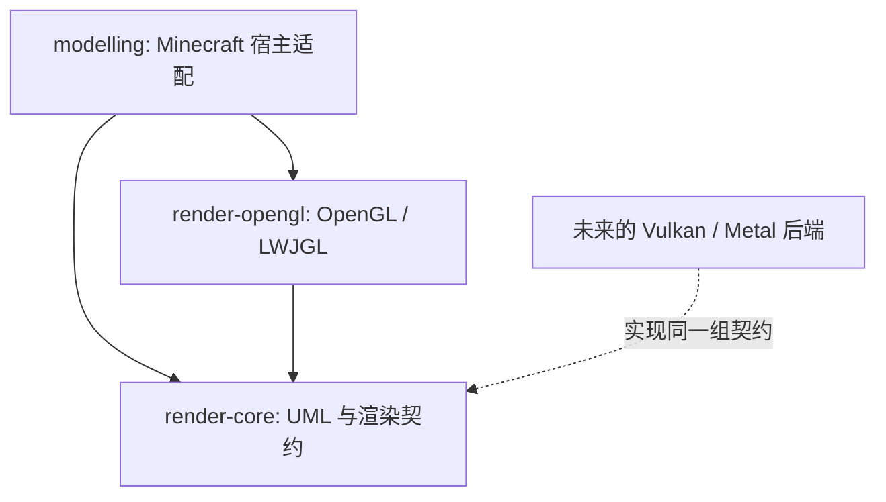
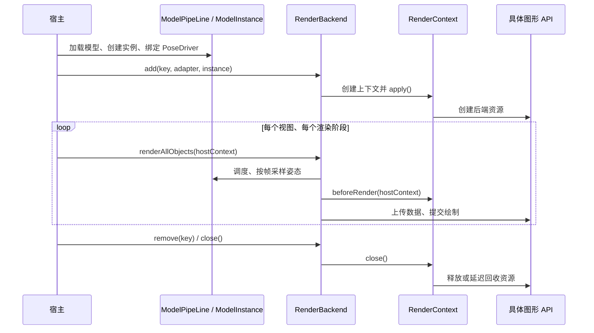

# 渲染模块与图形 API 的边界

后端接入与契约参考；模块分层、资源所有权和同步原理见 [原理文档](../doc/rendering-backends.md)。

## 模块依赖

`render-core` 是普通 Java library，不应用 ModDev 插件，不依赖 Minecraft、
NeoForge、LWJGL 或具体的图形 API。`compileJava` 前会执行
`checkGraphicsApiIsolation`，检查源码导入及编译、运行依赖，防止这些依赖重新进入核心。
DataFixerUpper 用于现有数据编解码；它不是 Blaze3D 或 Minecraft 渲染器。
formula、utils 的依赖关闭传递解析，只复用已有的 Java 表达式和数据结构。

`render-opengl` 同样不应用 ModDev。它依赖核心和 LWJGL，集中管理 GL buffer、
texture、shader、VAO、fence、FBO、读回和预览窗口。运行它的宿主负责提供当前
GL 上下文、正确的线程以及对应平台的 LWJGL natives。

`modelling` 保留 Minecraft 的世界渲染事件、RenderType、VertexFormat、纹理图集、
光照、Iris/Sodium 兼容和多摄像机世界渲染。这些类是当前 Minecraft + OpenGL
组合的宿主适配器，不能作为其他图形 API 的通用接口。

## UML 与资源生命周期

核心包含模型加载、模型结构、骨骼、morph、动画、FSM、姿态采样及调度，
以及 `RenderBackend`、`RenderContext`、`ModelGeometryAdapter`、`RenderableFactory`、
`RenderBuffer`、`TypedBuffer` 和输出路由契约。其资源类型、宿主帧上下文和
变换元数据都是泛型，不要求使用 GL 对象或 Minecraft 类。

`Backend` / `BackendContext` 提供默认挂载和释放行为，具体后端实现上下文创建、
数据打包和绘制。挂载失败不会发布半成品上下文；移除实例只释放该挂载的后端
资源，模型实例自身由模型管线管理。

核心仍包含现有 Box3D 的 Java/JNI 物理适配。物理不是图形 API 的组成部分；
独立使用时，启用 Box3D 的宿主需要额外提供对应平台的 native library。

## 上传与输出

`UploadRing` 只负责槽位轮换、脏元素合并、版本追踪和资源生命周期，通过
`UploadDevice` 执行分配、写入和完成状态查询。生产路径中的 `GpuUploadRing`
现在是它的 OpenGL 适配器，保留原有构造方法、统计类型和 FloatBuffer 入口。
macOS TBO 的 orphan 策略继续由 OpenGL 模块中的 `MacTboUploadDevice` 提供。

`UploadDevice` 的整数 buffer token 和 long 完成 token 是后端内部的不透明句柄，
不是跨 API 的原生资源编号。新后端可以将它们映射到自己的资源表。
设备必须保证替换存储后，已经提交的读取仍有效；完成查询不能阻塞。无法满足
这一契约的设备应使用自己的上传实现，并复用更上层的 `UploadBuffer` / `RenderBuffer`。

`FrameOutputRouter<T>`、`FrameOutputTarget<T>`、`OutputFrame<T>` 和摄像机状态属于核心。
`T` 由后端定义。`FrameTexture` 是 OpenGL 的 framebuffer/texture 载体，属于
OpenGL 模块；其他 API 应提供自己的输出载体和 target。

## 接入其他 API

1. 新建独立 Java 后端模块，仅依赖 `render-core` 和目标 API 的绑定。
2. 实现 `RenderBackend` / `RenderContext`，或扩展默认 `Backend` / `BackendContext`。
   模型、骨骼及姿态数据直接从现有 `ModelInstance` 读取；适配器负责目标 API 的
   顶点布局、骨骼数据表示、shader、同步和提交。
3. 由宿主注入对应后端及宿主帧上下文。`ModelPipeLine.Builder` 已支持注册后端；
   默认实现可扩展 `Backend`，独立的 `RenderBackend` 实现也可直接挂载模型实例。
4. 实现 `FrameOutputTarget<YourFrame>`，复用核心输出路由和摄像机生命周期。
5. 在宿主适配层处理窗口、资源重载、渲染阶段以及其他平台互操作。

现有公共类名保留，以维持调用和序列化名称兼容。因此部分 GL 类仍使用历史上的
`uml.backend.gpu` 包名，纯数学 `Direction` 也保留历史 `models.mc.util` 包名。
是否属于核心以 Gradle 模块依赖为准；核心不能导入 OpenGL 模块。

这次拆分没有实现 Vulkan/Metal 后端，也没有让 Minecraft 的 Blaze3D 在运行时
切换 API。Minecraft 的效果管线描述目前仍使用其自身绘制状态；需要更换该
宿主的整个渲染器时，还需实现对应宿主适配和 shader 生成路径。
