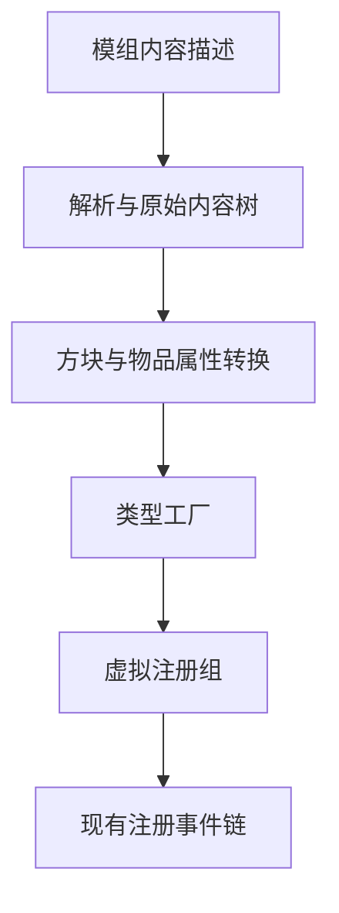

# 数据驱动注册原理

文件结构、字段、工厂和属性扩展见 [API reference](../api/data-driven-registration.md)。

## 从内容描述到注册树

数据包描述方块、物品和方块实体，解析层只构建原始内容树。属性解析器将描述转换为属性变换，
工厂把类型描述转为现有注册节点，最后把虚拟注册组挂到模组的主注册树。
数据内容复用原有注册事件分派，不维护第二套并行注册体系。

解析、属性扩展和对象构建分开，使自定义内容可以复用默认属性处理，也让 Java 注册与数据注册共存。
创意标签页仍通过既有修饰路径注入。复杂行为保留在代码侧，内容只选择行为工厂和参数。

## 初始化顺序

内容树惰性构建发生在首次注册分派，而非任意资源扫描时。这样工厂类型和自定义属性解析器能先随
上下文类初始化完成，解析时不会因为静态注册尚未发生而缺少工厂。

组的层次关系用于组织和共享属性，但组继承并不代表所有物品属性都已完整合并。某些类型、循环依赖
检测、DataFixer 类型以及更复杂的物品组件仍属于实现边界，不能仅凭描述文件存在推断已支持。
