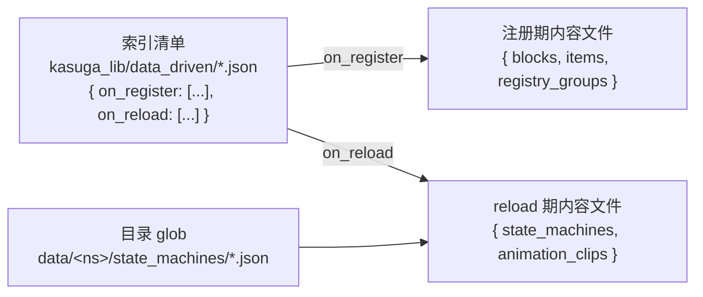

# 路径 1：用数据驱动文件来添加内容（组织方式与最佳实践）

> 面向**内容作者**：不写 Java，只用 JSON 往项目里加方块、物品、分组、状态机与动画剪辑。
> 适用版本：Minecraft 1.21.1 · NeoForge 21.1.203 · Parchment 2024.11.17 · Java 21。文中行号对应当前工作树（未提交的 data-driven 重实现），基准 commit `ec864a1`。
> 本文回答「怎么组织文件」和「为什么这么组织」，字段的完整清单不在这里 —— 见 [schema.md](schema.md)。

本文写给「手上有一个具体目标」的人：要加一节车厢的方块，要接一块风扇，要配一个创造栏。
每一步给可照抄的 JSON 片段，并说明代价。凡是要写 Java 才能做到的事（注册 `type` 对应的工厂、注册
新的顶层字段），一律在 [guide-extension.md](guide-extension.md) 里，本文不重复。

---

## 0. 先把三个概念分清（约 30 秒）

三个词在这套系统里各有明确身份：

- **索引清单（index manifest）**：一份「要解析哪些文件」的清单文件。它只列路径，不包含任何对象定义。
- **内容文件（content file）**：方块、物品、分组这些定义的**唯一事实来源**。顶层字段名（`blocks`、`items`、`registry_groups`）决定这组定义交给哪个处理器。
- **域（domain）**：内容文件按读取时机分成两个域。**注册期（register）**内容在模组构造时读一次，写进 Minecraft 注册表；**reload 期（reload）**内容在 `/reload` 时读，写进 reload 桶；状态机和动画剪辑属于这里。

三者关系：



这个图里有一处**不对称**，是全文最容易踩的坑：`state_machines/` 有一个额外的目录 glob 入口，
而 `animation_clips/` 没有 —— 后者的文件**只能**靠索引清单列出（详见第 6 节）。

字段名、类型、必填、默认与规则编号 D1–D6 的权威表在 [schema.md](schema.md)，本文的示例都从真实夹具抄来，可以照着改。

---

## 1. 目标：让一批内容被加载 —— 索引清单怎么组织

### 1.1 索引目录是固定的，不能换位置

把清单放进这个四段路径，拼写必须逐字一致：

```
data/<你的 mod id>/kasuga_lib/data_driven/
```

路径由 `JsonTreeBuilder.indexDirectorySegments(modId)` 锁死为 `{"data", modId, "kasuga_lib", "data_driven"}`（`JsonTreeBuilder.java:745-747`）。
`kasuga_lib` 用下划线，`data_driven` 也用下划线；写成 `kasuga-lib` 或漏掉 `kasuga_lib` 这一层，
系统会认为你没有索引目录，然后**什么都不做**（只在日志留一条 DEBUG）。目录下**所有** `.json` 文件都被当作清单，
按文件名升序读取；`index.json` 只是惯例名，不是必须（`JsonTreeBuilder.listIndexFiles`，`:762-774`）。

因此这条目录里**不要放内容文件** —— 内容文件会被当成清单去解析，报「缺 `on_register`/`on_reload`」。

### 1.2 一个 mod 一个清单，还是多个？

**两者都行，且可以混用。** 同一个 mod 在索引目录下的全部 `.json` 清单会被先读齐、再统一消费；
路径按「清单文件名升序 → 清单内数组书写顺序」拼接（`JsonTreeBuilder.java:92-96`、`:296-301`）。

取舍：

- 拆分的好处是**每个功能单元可以自带一份清单片段**。KuaYue 每节车厢一个 `data/kuayue/kasuga_lib/data_driven/cXX.json`，编译后这些片段合并进同一个 jar 目录，由系统当同一个 mod 的多份清单聚合（见第 9 节）。
- 拆分的代价是**文件名要唯一**。多份清单合并后同名会互相覆盖不了（它们是并列追加，不是覆盖），但你得保证每份清单只列自己的文件，否则会重复解析（同一路径在同一 mod 内被多处列出会**静默去重**，不报错，`parseSource` 的 `parsedSources`，`:400-402`）。

### 1.3 `on_register` 与 `on_reload` 各列什么

清单只有两个顶层字段，各自是字符串数组：

| 字段 | 列什么 | 读取时机 |
|------|--------|----------|
| `on_register` | 方块、物品、分组等要进 Minecraft 注册表的内容文件 | 模组构造期，一次 |
| `on_reload` | 状态机、动画剪辑等 reload 期内容文件 | 每次 `/reload` |

两个字段**都可不写，但至少要写一个**；只写 `on_reload` 的「纯 reload mod」是合法的（`JsonTreeBuilder.java:100-104`、`:323-326`）。
空数组 `[]` 也算「写过了」（规则 D2）。写成「一个都不写」会记一条 error。

一份最小的双域清单：

```json
{
  "on_register": [
    "kasuga_lib_content/groups.json",
    "kasuga_lib_content/blocks.json"
  ],
  "on_reload": [
    "animation_clips/fan_fsm_data_driven.json"
  ]
}
```

数组元素是**相对于 `data/<你的 mod id>/` 的路径**，必须带 `.json` 后缀，不能以 `/` 开头，不能含空段或 `.`/`..` 段
（`JsonTreeBuilder.validateSourcePath`，`:383-392`）。它永远被拼在 `data/<你的 mod id>/` 之下，所以**跨命名空间在结构上不可能**。

> **最佳实践**：把组（`groups.json`）写在方块的清单之前，人能一眼看出依赖。但这与「顺序有语义」无关 —— 分组的应用阶段本来就早于方块，见第 3 节。

### 1.4 为什么漏列就等于永不加载

注册期**没有目录扫描**：`buildForMod` 只读 `on_register` 里列出的路径，不会去 walk 你的 `data/` 目录（`JsonTreeBuilder.java:105-110`）。
一个内容文件就算真实存在于 jar 里，只要没被任何清单列出，就**永远不会被读取**，也不会有任何报错。

reload 侧的规则不同：`state_machines/` 有一个目录 glob，`animation_clips/` 没有。两者的差别在第 6 节展开。

**代价**：索引是手动维护的清单，「加文件 = 改索引」是这套设计换取「加载什么完全可控、可审计」付出的成本。
一旦改了目录结构却忘了改索引，症状是**静默少加载**，不是报错。所以第 8 节的验证步骤里第一件事就是数日志里的条数。

---

## 2. 内容文件怎么切分

内容文件放在 `data/<你的 mod id>/` 下的任意位置（不必挤在索引目录旁边），一个文件可以同时包含多个顶层字段。
文件之间**不互相引用**，所以没有递归、也用不着环检测（`JsonTreeBuilder.java:372-373`）。

### 2.1 按类型切，还是按功能切

两种都成立，选择取决于你要回答的问题是「这类东西都在哪」还是「这个功能的东西都在哪」。

**按类型切**（组、方块各一个大文件）：

```text
data/mymod/kasuga_lib/data_driven/index.json
data/mymod/content/groups.json        # 所有 registry_groups
data/mymod/content/blocks.json        # 所有 blocks
data/mymod/content/items.json         # 所有独立 items
```

**按功能切**（每个功能目录自带类型文件）：

```text
data/mymod/kasuga_lib/data_driven/panels.json     # on_register: content/panels/*
data/mymod/kasuga_lib/data_driven/lighting.json   # on_register: content/lighting/*
data/mymod/content/panels/groups.json
data/mymod/content/panels/blocks.json
data/mymod/content/lighting/groups.json
data/mymod/content/lighting/blocks.json
```

取舍：

- 按类型切，**复用与跨功能查找方便**（一个文件就是一个类型的全集），但文件会越来越大，多人同时改一个文件容易冲突，且没有天然的边界提醒你别把不相关内容塞进去。
- 按功能切，**一个功能的改动集中在一处**，适合「一节车厢 = 一个功能」这种能独立交付的单元；代价是每个功能都要在索引里逐个列出自己的文件。

> **最佳实践**：以「能独立交付、能独立验证的最小单元」为切分单位。功能单元内部再按类型分文件（`groups.json` + `blocks.json`），既保留了复用性，又让索引条目保持可读。KuaYue 的车厢就是这么切的（第 9 节）。

### 2.2 文件切多了，索引就要逐个列

按功能切之后，清单会长成一行一个文件的样子 —— 这正是它的作用：**清单就是「这个功能包含哪些文件」的显式声明**。
不要为了让清单短一点就把整块内容塞进一个文件。清单变长是可读性成本，塞大文件是维护性成本，前者更好处理。

---

## 3. 目标：多个方块共享属性 —— 用 `registry_groups` 做继承

分组（group）是共享属性的容器：把 `properties` 写在一组上，组内方块自动继承。

### 3.1 建组并让方块挂上去

```json
{
  "registry_groups": [
    {
      "id": "mymod:base_panels",
      "properties": {
        "no_occlusion": true,
        "strength": [1.5, 3.0]
      }
    },
    {
      "id": "mymod:detail_panels",
      "parent": "mymod:base_panels",
      "item_properties": {
        "tab": "mymod:main_tab"
      }
    }
  ]
}
```

方块用 `registry_group` 指定挂哪个组：

```json
{
  "blocks": [
    {
      "id": "mymod:simple_panel",
      "type": "simple_block",
      "registry_group": "mymod:detail_panels",
      "properties": {
        "destroy_time": 2.0
      }
    }
  ]
}
```

这段话照抄自真实夹具 `modules/data-driven/src/contentTesting/resources/data/kasuga_lib/kasuga_lib_content/groups.json` 与 `blocks.json`。

### 3.2 继承链：方块级 > 子组 > 父组 > 根

属性不是「合并」，而是沿父链**依次套用**：先套父组的，再套自己的，所以越靠近方块的定义越晚生效、越能盖住前面的
（`Reg.applyProperties`，`Reg.java:103-114`）。优先级一句话：

> **方块级 > 子组 > 父组 > 根组。**

这个顺序对 `properties` 和 `item_properties` 都成立，真实夹具 `inheritance_blocks.json` 演示了三种情况：

```json
{
  "blocks": [
    { "id": "mymod:inherited_block", "type": "simple_block", "registry_group": "mymod:inherit_group" },
    {
      "id": "mymod:overridden_block",
      "type": "simple_block",
      "registry_group": "mymod:inherit_group",
      "properties": { "strength": [5.0, 5.0] }
    },
    {
      "id": "mymod:item_inherit_override",
      "type": "simple_block",
      "registry_group": "mymod:inherit_group",
      "item_properties": { "stacks_to": 1, "durability": 100 }
    }
  ]
}
```

- `inherited_block` 不动任何属性，完全继承组。
- `overridden_block` 用方块级 `properties.strength` 盖掉组里的值。
- `item_inherit_override` 用方块级 `item_properties` 盖掉组的 `stacks_to`，并补上组里没有的 `durability`。

有一个例外值得单独记：**创造栏标签页（`tab`）**。组上的 `item_properties.tab` 会被单独记下来，
只有当方块自己没有 `tab` 时才用（`RegTypeHandler.java:89-97`）。也就是「方块级 `tab` 优先」这条和多数字段一样，但实现走的是另一条通道，排查标签页问题时要想到这里。

### 3.3 父组缺失与成环会怎样

两种异常都被兜住，不会崩溃，但结果可能和你预期不同：

- **父组不存在** → 该组**静默挂到根组**（`RegistryGroupHandler.store`，`:58-63`）。方块照常注册，只是继承不到东西。**没有日志提示**。
- **祖先链成环** → 加载器先做拓扑排序，检测到环会打一条 WARN：`Cycle detected among registry groups: [...]`，环里的组退回原始顺序、最终挂到根（`JsonTreeBuilder.java:823-842`）。

真实夹具 `edge_cases_groups.json` 里就有现成的环：

```json
{
  "registry_groups": [
    { "id": "mymod:orphan_group" },
    { "id": "mymod:circular_a", "parent": "mymod:circular_b" },
    { "id": "mymod:circular_b", "parent": "mymod:circular_a" }
  ]
}
```

`orphan_group` 显式没有 `parent`，挂根；`circular_a`/`circular_b` 互为父。

**代价与建议**：分组继承省下了大量重复字段，但「静默挂根」意味着**写错组 id 不会报错**。
所以组 id 建议带命名空间前缀（`mymod:` 开头），并让「组定义」和「引用组的方块」在同一份清单里成对出现，
改 id 时一改一对。

---

## 4. 目标：出重复 id 时知道谁赢 —— last-wins

### 4.1 什么算「同一个 id」

重复只在**同一个类型字段内**判定（`blocks` 之间比、`items` 之间比、`registry_groups` 之间比、内嵌的方块实体之间比）。
不同字段的同名**不算冲突**（`DuplicateIdResolver` 的碰撞键是 `(typeName, identity)`，`:73-100`）。

三种类型的 identity 算法不同：

| 类型 | identity 是什么 | 归一化 |
|------|-----------------|--------|
| `blocks` / `items` | 注册时的 `ResourceLocation` | 无命名空间或 `minecraft:` 前缀 → `<你的 mod id>:<path>`；其它命名空间原样保留（`EffectiveId.of`，`:39-52`） |
| `registry_groups` | 条目的**字面** `id`，不归一化 | 组是内部节点、不进注册表，`door` 与 `minecraft:door` 算两个组（`RegistryGroupHandler.resolveIdentity`，`:50-52`） |
| 内嵌方块实体 | **宿主方块**的 identity | 同一个方块上写两个 `block_entity` 才算重复（`BlockEntityTypeHandler.resolveIdentity`，`:66-68`） |

归一化这条最容易踩：`foo` 和 `minecraft:foo` 作为方块**是同一个 id**，会互相冲突（`EffectiveIdTest.explicitMinecraftNamespaceResolvesToTheOwningMod`）。
但 `blocks` 里的 `foo` 与 `items` 里的 `foo` 不冲突，是两个注册空间。

### 4.2 「后」指加载顺序，不是字典序

系统对重复的规则是 **last-wins（后定义者胜）**。「谁在后」完全由加载顺序决定：

1. 同一 mod 的多份清单，按**文件名升序**；
2. 一份清单的 `on_register` 数组内，按**书写顺序**；
3. 一个内容文件的类型数组内，按**书写顺序**。

这条被 `DuplicateIdResolverTest.lastMeansLastInSequenceNotLexicographicallyLastSource` 专门锁死：即使后出现的候选来自路径字典序靠前的文件，它仍然是赢家。
换句话说，**顺序是有语义的开关，不是布局偏好**。

### 4.3 冲突时的行为：隔离，不崩

发现重复时（`DuplicateIdResolver.describe`，`:109-115`）：

- **不崩溃**：加载照常完成，游戏正常进。
- **输家整条不生效**：先定义的那条**根本不会走到注册**，避免在 Minecraft 注册表里留下幽灵条目。
- **不连坐**：只丢冲突的那一条，文件里其它条目、其它类型照常。
- **留证据**：一条 WARN 日志（给出 id、类型字段、胜者和败者各自的来源文件）+ 一条记入该 mod 的加载错误。

> **最佳实践**：把顺序当作「覆盖开关」而不是「布局」。没有覆盖意图时，保证 id 在类型内唯一，别让 WARN 出现；
> 有覆盖意图时（基础文件 + 变体文件），在清单里用注释或命名点明哪个是补丁文件。
> 代价是：这种覆盖**不会告诉你「谁被盖了」除了那条 WARN**，所以覆盖文件要尽量小而集中。

---

## 5. 目标：给方块绑方块实体 —— 内嵌类型怎么用

### 5.1 方块实体是内嵌的，不是顶层字段

方块实体（block entity，BE）不占独立顶层字段，它写在方块条目的 `block_entity` 键里：

```json
{
  "blocks": [
    {
      "id": "mymod:be_test_block",
      "type": "be_block",
      "registry_group": "mymod:data_driven_group",
      "block_entity": {
        "type": "my_be",
        "params": {
          "tick_interval": 4
        }
      }
    }
  ]
}
```

（来自 `kasuga_lib_content/block_entities.json`。）`block_entity` 认 `type`（BE 工厂）与 `params`；
系统在宿主方块注册后自动创建 BE、挂为它的子节点，BE 的 id 自动取 `<方块 path>_be`。
所以**一个方块最多内嵌一个 BE**（`BlockEntityTypeHandler.apply`，`:88-95`）。

Fsm 方块有一个常见写法：`state_machine` 写在**方块条目**顶层，系统把它转发进 BE 的 `params`：

```json
{
  "blocks": [
    {
      "id": "mymod:my_fsm_block",
      "type": "fsm_block",
      "registry_group": "mymod:data_driven_group",
      "state_machine": "mymod:my_machine",
      "properties": { "destroy_time": 2.0 },
      "block_entity": {
        "type": "fsm_be",
        "params": { "model": "mymod:models/my_cube.obj" }
      }
    }
  ]
}
```

（来自 modelling contentTesting 的 `fsm_blocks.json`；转发逻辑在 `BlockEntityTypeHandler.extractEmbedded`，`:33-44`，由 `BlockEntityStateMachineExtractTest` 覆盖。）

### 5.2 「写在同一个文件」还是「单独一个文件」

`block_entities.json` 这个文件名是个惯例，**它打开后顶层键依然是 `blocks`**。所以这里的选择其实是文件组织，不是语法：

- 把带 BE 的方块和普通方块放一起：方块全景在一处，方便对照。
- 单独开一个文件（如 `block_entities.json`）只放带 BE 的方块：一眼能看出「哪些方块有实体」，也方便这类方块单独演进。

两种都要在清单里列出该文件。取舍是**复查成本**：单独文件让 BE 集合更醒目，但要让「一个方块的完整定义」跨两个文件才能看全。

### 5.3 反模式：把内嵌类型写成顶层字段

下面这种写法**不合法**：

```json
{
  "block_entities": [ { "type": "my_be" } ],
  "blocks": [ { "id": "mymod:ok", "type": "simple_block" } ]
}
```

结果是：顶层 `block_entities` 被报为「不支持的顶层字段」，并附一句提示「它应该写在 `blocks` 条目的 `block_entity` 键里」；
关键是**同文件的 `blocks` 仍然照常分派**（半应用），不会因为这一处错就丢掉整个文件（`JsonTreeBuilderEmbeddedTypeDispatchTest.topLevelEmbeddedTypeIsReportedAndTheRestOfTheFileStillDispatches`，`JsonTreeBuilder.java:475-490`）。

同理，单个 BE 在 apply 阶段失败（例如 BE 工厂不存在）只打 WARN 并跳过，不影响同文件其它方块（`BlockEntityTypeHandler.apply`，`:81-100`）。

> **最佳实践**：`block_entity` 永远贴着它的宿主方块写。BE 没有自己的 id，「孤儿 BE」在语法上就不存在。

---

## 6. 目标：加状态机与动画剪辑 —— reload 域的内容

reload 域有两类内容，顶层字段名就是它们各自唯一的合法键。

### 6.1 状态机（`state_machines`）：两条入口

状态机文件长这样：

```json
{
  "state_machines": [
    {
      "id": "mymod:fan_machine",
      "state_vars": [
        { "name": "cycle", "type": "bool", "default": false, "ephemeral": true, "reference": "mymod:fan/cycle" }
      ],
      "layers": [
        {
          "id": "gear",
          "mode": "base",
          "initial_state": "off",
          "states": [
            { "id": "off", "clip": { "id": "mymod:fan_clip", "loop": true } },
            { "id": "g1", "clip": { "id": "mymod:fan_clip", "loop": true } }
          ],
          "transitions": [
            { "id": "off_to_g1", "from": "off", "to": "g1", "trigger_on": "cycle", "cross_fade_seconds": 0.25 }
          ]
        }
      ]
    }
  ]
}
```

（真实夹具 `modules/modelling/src/contentTesting/resources/data/kasuga_lib/state_machines/fan_machine_data_driven.json` 的完整版有 4 个状态、4 条转移，这里为篇幅取了子集，字段一字未改。）

状态机有**两条入口**，二选一或并用：

1. **目录 glob**：把文件放到 `data/<你的命名空间>/state_machines/*.json`，就会被自动发现（`StateMachineDefinitionLoader.PATH = "state_machines"`，`:39`；目录由 `FsmReloadHandler.globDirectories()` 声明，`:69-71`）。**不需要列进索引。**
2. **`on_reload` 数组**：在清单里列出路径，也读。

两条入口都命中同一文件时，glob 会跳过已被索引列出的那条，于是它只被读一次（`ReloadOrchestrator.collectGlob`，`:348-367`）。
两种入口的相对先后是 **glob 先、索引后**，同 id 仍是后者胜（`ReloadOrchestrator` 类文档，`:77-91`）。

### 6.2 动画剪辑（`animation_clips`）：只有索引一条入口

```json
{
  "animation_clips": [
    {
      "id": "mymod:fan_clip",
      "duration_seconds": 12.0,
      "functions": [
        { "bone": "fan", "channel": "rotate", "y": "11 * query.angle" },
        { "bone": "cover", "channel": "rotate", "z": "sin(rad(2 * query.angle)) * 30" }
      ]
    }
  ]
}
```

（来自 `animation_clips/fan_fsm_data_driven.json`。）

`animation_clips/` 没有目录 glob，剪辑文件只能通过清单的 `on_reload` 数组读到
（`AnimationClipLoader` 类文档，`:28-29`）。把剪辑文件放进 `data/<ns>/animation_clips/` 却忘了在清单里列，
它**永远不会被加载，也不会有任何提示**。

对照真实夹具 `modelling.json`，`on_register` 列了两条、`on_reload` 一条：

```json
{
  "on_register": [
    "kasuga_lib_content/fan_formula_data_driven.json",
    "kasuga_lib_content/fsm_blocks.json"
  ],
  "on_reload": [
    "animation_clips/fan_fsm_data_driven.json"
  ]
}
```

状态机文件 `state_machines/fan_machine_data_driven.json` **没在这份清单里** —— 它是被 glob 捡走的。`fsm_blocks.json` 原属 data-driven 的 contentTesting，因 `fsm_block` / `fsm_be` 工厂只在 modelling 而迁到 modelling 侧（内容仍以 `blocks` 顶层键书写）。

### 6.3 reload 内容的几条规则

- **一个文件可以带多个顶层键**：同一文件里写 `state_machines` 和 `animation_clips` 都合法，两个 handler 各读自己的键、各注册各的条目（`ReloadOrchestrator.dispatch`，`:429-470`）。
  **真未知键**（不被任何 reload 类型认领，如误写的 `foo`）会被报一条顶层字段不受支持的 error，但已知键照常贡献，不会连累整个文件。
- **reload 路径走资源包栈**：`on_reload` 的路径用 `ResourceManager.getResource` 解析，所以**数据包可以覆盖**你的 reload 内容；
  而 `on_register` 走的是 mod 的 jar（`IModFile.findResource`），数据包覆盖不到（`ReloadOrchestrator.collectIndex`，`:369`）。
- **悬空剪辑引用会被事后检查**：一轮 reload 结束后，加载器会检查每个刚注册的状态机定义里 `states[].clip` 指向的 id 是否存在，
  缺失则打 WARN 并记入错误桶，同时该状态退化为静态 pose（`FsmReloadHandler.afterReload`，`:95-116`）。检查**不会阻止注册**。

> **最佳实践**：状态机放在 `state_machines/` 靠 glob 自动发现，减少清单维护；剪辑必须逐条列进 `on_reload`，所以剪辑文件的粒度宁可粗一点（一个功能一个文件），别让清单变成几十行。

---

## 7. 反模式与边界清单

| 你写的 | 症状 | 原因 / 处理 |
|--------|------|-------------|
| 清单里写 `"sources": [...]` | 两条 error：`contains unsupported field 'sources'` + `declares neither 'on_register' nor 'on_reload'`，该清单不贡献任何路径 | `sources` 是**已废弃字段**，不是别名（`JsonTreeBuilder.parseIndexManifest`，`:222-243`；`JsonTreeBuilderIndexSchemaTest.legacySourcesFieldIsReportedAsUnknown`）。改成 `on_register` |
| 把 `state_machines` 文件列进 `on_register` | error：`unsupported top-level field 'state_machines'`，并提示「list this file under 'on_reload' instead」 | D9 条件提示；注册域不认识 reload 域的形状，提示把你指向另一个数组（`JsonTreeBuilder.java:474-491`；`JsonTreeBuilderReloadHintTest`） |
| 把注册内容列进 `on_reload` | error：`unsupported top-level field 'blocks'`，并提示改列 `on_register` | 反向 D9 提示（`ReloadOrchestrator.dispatch`，`:441-446`） |
| 同一路径同时出现在 `on_register` 和 `on_reload` | error，且该路径**两个域都不消费** | 规则 D6 的 fail-closed（`JsonTreeBuilder.resolveIndexManifests`，`:308-316`；`JsonTreeBuilderIndexSchemaTest.crossListedPathIsConsumedByNeitherDomain`） |
| 顶层写 `block_entities` | error + 提示写到 `blocks` 条目的 `block_entity` 键 | 内嵌类型不占顶层字段（第 5.3 节） |
| 路径写成 `/blocks.json`、`blocks`（缺后缀）、`a/../b.json` | error：`path must be relative` / `path must include the '.json' suffix` / `path must not contain '.' or '..'` | `validateSourcePath`（`:383-392`；`JsonTreeBuilderSourcePathTest.rejectsMalformedSourcePaths`） |
| 清单指向一个不存在的文件 | error：`Source file not found ...` | 路径相对 `data/<mod>/`；先确认文件真的进了 jar |
| 索引目录里放了内容文件 | error：该文件被当清单解析，报缺两个域字段 | 索引目录只放清单 |
| 方块 `type` 没有对应工厂 | 方块不出现；日志 WARN `No factory for type '...'` | **只记日志、不入错误桶**（`RegTypeHandler.apply`，`:70-74`）。工厂要先注册，见 [guide-extension.md](guide-extension.md) |
| 方块引用了不存在的 `registry_group` | 方块仍出现，但属性/标签页不符预期 | **静默挂根组**，无日志（第 3.3 节） |
| 属性名写错（如 `sound_type` 拼错） | 该属性被忽略；日志 WARN `Unknown block property` / `Unknown sound type` | **只记日志、不入错误桶**（`JsonPropertyParser`，`:50-57`、`:87-95`） |
| 注册期某元素 `parse` 抛异常（该元素字段畸形） | error：`Content file '<label>' for mod '<mod>': entry <i> in '<key>' failed to parse: <msg>; entry skipped` | **只丢该元素**，同文件兄弟条目照常注册（`JsonTreeBuilder.java:530, 592`；与 reload 侧 `…; element skipped` 同构）。 |

> **最佳实践**：区分「会入错误桶的错」和「只打 WARN 的错」。前者（索引、路径、字段、重复 id、apply 失败）可以靠 `getLoadingErrors` 断言红灯；
> 后者（未知工厂、未知属性、缺失组、组成环）只能靠**读日志**发现。把这两类混为一谈会漏掉后半截问题。

---

## 8. 目标：确认写对了 —— 验证与排查

### 8.1 先数日志条数

启动后日志里应出现这一行（INFO）：

```
Loaded N JSON entries across M types for mod '<你的 mod id>'
```

`JsonTreeBuilder.java:114`。`N` 是解析到的条目总数，`M` 是有内容的不同顶层类型数。
打开 DEBUG 还能看到每个类型的应用条数（`Applying N entries for type '<type>'`，`:129`）。**N 偏小通常就是漏列索引或路径写错**。
若完全没有这一行，先确认索引目录路径（目录不存在时只有一条 DEBUG：`No data-driven index directory for mod '...'`，`:77`）。

### 8.2 用命令看错误桶

游戏内（需要权限等级 2）：

```
/kasuga_data errors
/kasuga_data errors <你的 mod id>
```

不带参数打印每个非空桶的一行摘要（**两维都在内**：mod 维与 reload 的 `RELOAD_DATA[<命名空间>]` 源维），带 mod id 打印该 mod 的两维逐条失败
（`DataDiagnosticsCommands`，`:45-92`）。注册期错误进 mod 维；reload 期错误进 `Domain.RELOAD_DATA` 源维、键 = 命名空间（`ReloadOrchestrator.reportError`，`:566-573`）。

### 8.3 在测试里断言错误桶为空

集成测试或调试工具可以直接断言：

```java
JsonTreeBuilder.getLoadingErrors("mymod")   // 该 mod 的错误列表
JsonTreeBuilder.getLoadingErrorsByMod()     // 按 mod 分桶
```

把「静默错误」变成红灯，这是最省事的办法。错误桶按 mod 隔离，一个 mod 的 `buildForMod` 只会清自己的桶（`JsonTreeBuilderLoadingErrorTest.errorsAreIsolatedPerMod`）。

### 8.4 一张排查顺序表

| 现象 | 先看 |
|------|------|
| 没有任何 `Loaded ... JSON entries` | 索引目录四段路径对不对？目录里有没有 `.json`？ |
| N 比预期少 | 清单是不是漏列？`Source file not found`？ |
| 方块不出现 | `No factory for type`？（WARN）；方块物品、blockstate、模型资源是否齐全？ |
| 属性不对 | `Unknown block property`（WARN）；`registry_group` 是否写对（静默挂根）？ |
| 某个 id 生效的不是自己写的那条 | 重复 id 的 WARN，看胜者/败者来源文件（第 4 节） |
| 状态机没生效 | 文件在 `state_machines/` 吗？或列进了 `on_reload` 吗？ |
| 剪辑没生效 | **几乎一定是没列进 `on_reload`** —— 剪辑没有 glob（第 6.2 节） |
| 状态机跑了但动画是静止的 | 看 `unresolved clip references after reload` WARN（第 6.3 节） |

---

## 9. 生产规模参考：KuaYue 车厢的组织方式

> 本节只读观察 `/Users/lingshi/coding/minecraft/Kuayue/KuaYue/modules/train-parts/resources/carriages/`，不修改。

KuaYue 的 11 节车厢（`22`/`25`/`25b`/`25g`/`25k`/`25t`/`25z`/`cr200j`/`freight`/`jy30`/`m1`）展示了「按功能切、每功能自带清单片段」在真实项目里的样子。每节车厢是一个**独立的资源编译模块**，源目录顶层是 `blockstates/`、`data/`、`lang/`、`loots/`、`models/`、`recipes/`、`tags/`、`textures/` 与 `module.toml` —— **没有 `assets/`**；要经资源编译才并入产物里的 `assets/`/`data/` 布局。模型资源、本地化、战利品表和数据驱动内容放在同一个车厢目录里一起交付。

数据驱动部分每节车厢三份文件（例外：`jy30` 有 `module.toml`，但没有任何 data-driven 内容，未参与数据驱动）：

```text
carriages/22/
├── module.toml                                              # 模块根标记
└── data/kuayue/
    ├── kasuga_lib/data_driven/c22.json                      # 索引清单（每车厢一份）
    └── carriages/c22/
        ├── groups.json                                      # 该车厢的分组
        └── blocks.json                                      # 该车厢的方块
```

清单内容是「先组后方块」：

```json
{
  "on_register": [
    "carriages/c22/groups.json",
    "carriages/c22/blocks.json"
  ]
}
```

分组（`c22`）：

```json
{
  "registry_groups": [
    {
      "id": "kuayue:c22_panels",
      "properties": {
        "no_occlusion": true,
        "strength": [1.5, 3.0],
        "map_color": "blue"
      },
      "item_properties": { "tab": "kuayue:train_panel_tab" }
    }
  ]
}
```

方块（`c22`，节选）：

```json
{
  "blocks": [
    { "id": "kuayue:22_floor", "type": "slab", "registry_group": "kuayue:c22_panels" },
    {
      "id": "kuayue:22_large_window",
      "type": "train_openable_window",
      "params": { "wide": 2 },
      "registry_group": "kuayue:c22_panels"
    }
  ]
}
```

**怎么切的、为什么**：

- **切分单位是一个车厢**，因为车厢能独立交付、独立验证，整节车的资源（模型、语言、方块定义）本来就一起走。
- **每个车厢一份清单**（`c22.json`、`c25.json`……文件名各不相同）。编译时它们合进同一个 jar 目录，由框架当同一个 mod 的多份清单聚合。这正好回答了第 1.2 节的问题：**「一个 mod 多份清单」在生产里就是按交付单元拆的**。
- **车厢内再按类型分两个文件**（`groups.json` + `blocks.json`），而不是把组和方块塞进一份 —— 保留了「按类型切」的可读性，同时**组排在方块前**，与框架「组先应用」的阶段顺序一致。
- **方块的 `type` 是 KuaYue 自己注册的工厂**（`slab`、`train_panel`、`train_openable_window` 等），不是库内置的测试工厂 —— 这正是 [guide-extension.md](guide-extension.md) 讲的扩展点在生产里的用法。

**一条与数据驱动内容无关、但会让内容「凭空消失」的教训**：`cr200j` 与 `freight` 两个车厢目录**没有 `module.toml`**。
资源编译器只 walk **含 `module.toml`** 的目录（`ResourceCompilerMain.java:24-39`；`ResourceScanner.scanModule`，`:43-58`），
所以这两个目录里的内容（包括索引与数据驱动文件）**不会进 jar**，里面的方块也就永远不会注册。
换到你自己项目时：清单写对了，还要确认承载它的目录真的被你的资源编译/打包流程收进去了。

---

## 10. 延伸阅读

| 你想要 | 去哪 |
|--------|------|
| 全部字段、类型、必填、默认、D1–D6 规则 | [schema.md](schema.md) |
| Java 类与方法的完整签名、加载时序、纯函数测试面 | [api.md](api.md) |
| 从零跑通第一条路径的入门 | [intro.md](intro.md) |
| 注册自己的 `type` 工厂、属性编译器、TypeHandler | [guide-extension.md](guide-extension.md) |
| Fsm 状态机的专门说明 | [`../fsm.md`](../fsm.md) |
