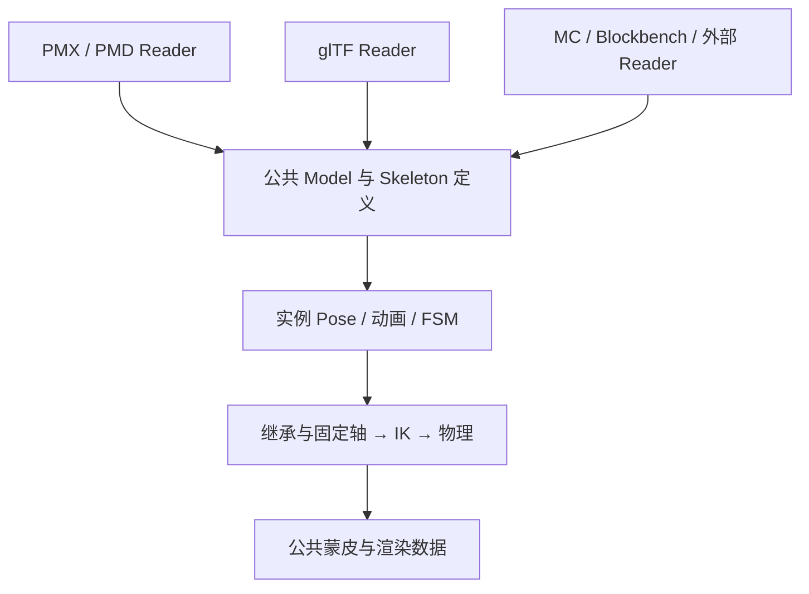

# Model 子系统的格式边界

接口参考见 [通用姿态与动画](../api/model-posing.md) 和
[骨骼动力学](../api/skeleton-dynamics.md)。

Model 只描述公共的几何、材质、骨架、morph 和命名动画。模型文件的格式决定如何读取这些内容，
不决定运行时能使用哪些能力。原始文件记录可以保存在 metadata 中，运行时子系统通过已转换的
公共定义求值，不根据 metadata 的具体类选择模型能力。

骨骼变换继承和固定轴是通用骨架能力。文件中的索引和 flag 在读取时转换为直接骨骼引用及
约束数据。求值会先解析被引用的局部姿态，所以另一分支尚未遍历也不会读到上一帧的值。
继承环没有定义良好的先后关系，构建时拒绝；菱形 IK 的位置闭环是独立的求解约束。
跨分支继承会影响源骨子树之外的顶点，更新时必须覆盖这些依赖。

动画保留各来源的采样算法，只要求输出公共 Pose。命名片段库组合 sampler 和源数据，
播放器处理时间，PoseSink 写入模型实例。静态姿态就是恒定采样的片段，使用相同的通道所有权
和重置规则。VPD/VMD 不要求目标骨架带 PMX metadata；骨名和通道标识匹配即可写入。
不同骨架之间的拓扑重定向仍是接入方的职责。

IK 开关也是 Pose 中的公共通道，因此动画和状态机都能使用同一写入路径。
共享 Model 保存能力定义，各实例保存播放位置、骨骼变换、IK 状态和物理模拟状态。
普通 MC 模型可以直接复用这些能力，无需伪造 MMD/glTF metadata。

渲染核心的构建检查禁止公共结构、动态运行时、数学和 framework 依赖具体格式包，
将格式访问限制在 Reader/Converter/Sampler 边界。

## 服装组装与缓存的边界

公共 Model 的组装能力将衣服骨骼映射到身体骨架，重映射顶点绑定、morph、材质、动画与动力学，
形成可复用的共享模型定义。具名身体区域由资源接入方提供，隐藏后删除面及不再使用的顶点。
接口参考见 [组装与缓存 API](../api/model-assembly.md)。

缓存键覆盖来源对象及其版本、组件顺序、骨骼映射、最终隐藏区域和接入设置。
只在缓存未命中时重建；相同穿搭的多个实例共享组装结果，各自持有姿态状态。
缓存按最近使用顺序淘汰，条目数和顶点数共同限制保留规模，避免穿搭组合无限增长。
原地修改资源需要更新版本或显式失效；整个模型的内容哈希不适合放在每次查询路径上。

缓存的是绑定姿态几何，动画仍在实例骨架上求值。合并几何能减少提交和重复骨架处理，
但不同材质和透明状态仍需分别渲染。减少被遮住的身体和内层服装才会降低这些区域的顶点与
像素成本。只有共享运动语义的部件才能直接共用骨架；服装独立骨骼、morph 和次级物理需要
在组装时保留并重新映射其依赖。公共骨骼还须具有兼容的绑定矩阵，不能用名称相同代替坐标匹配。

组装克隆可变结构，材质与帧定义按组件隔离，纹理资源继续由原资源系统持有。
缓存本身只保存 CPU 模型定义；GPU 缓冲与每实例状态的所有权仍在现有后端。
缓存淘汰不会销毁仍在渲染的模型，资源重载则需要宿主先结束旧实例再释放其借用资源。

资源级定义只保存宿主键、骨骼映射和可见区域，不保存某次加载的 Model 对象。
Minecraft 适配器等到所有来源都已发布，再把定义解析为一份完整组装请求。
来源替换或删除时，发布通知先撤掉派生实例及其缓存引用；保留定义以便下一代重新解析。
多个定义可以共享同一缓存模型，但实例按资源键隔离，替换一个定义不回收另一个定义的实例。

换装采用先准备后切换的顺序。来源暂缺时继续使用原来的穿搭，成功后迁移基础姿态与逻辑驱动，
再回收旧实例。资源重载则必须先撤掉借用旧纹理的对象，句柄保存待恢复状态，下一代就绪后再挂载。
模型几何版本与每角色逻辑时钟独立，命名动画刷新采样源时不替换被其他目标跟随的时间轴。

## Anchor 与可变形附件

Anchor 描述骨骼上的显示坐标系，在动画、IK 和物理完成后求值。它的绑定空间变换与顶点一样，
先应用逆绑定，再应用当前骨骼姿态，因而旋转和非均匀缩放也能与蒙皮保持一致。
局部挂接偏移在绑定时转换为作者坐标，运行时只跟随骨骼；渲染时在 double 中扣除相机原点，
避免大坐标被提前转换为 float 后丢失小位移。

整体运动的装备、工具和武器通过 Anchor 放置，宿主 renderer 决定它们的显示方式。
服装的顶点可能同时受多个骨骼控制，共享骨架组装保存这种变形语义。穿搭槽位可以同时组织两类
附件，但单个刚体挂接坐标系不能提供服装的逐顶点蒙皮，也不会替换绑定空间适配。
接口与 Minecraft 物品接入见 [Anchor API](../api/anchors.md)。
