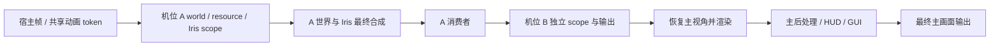

# 离屏、多机位与共享输出原理

创建相机、多窗口、headless 启动、FBO 消费与录制示例见 [API reference](../api/offline_rendering_and_multi_cam.md)。

## 一个客户端与多个世界视角

相机分为 Player、Free、Fixed 三类。Player 使用玩家原生视图与最终主画面；Free 拥有可直接控制或
由动画驱动的世界姿态；Fixed 绑定跟随目标，在渲染时采样其位置/朝向并组合偏移和独立投影。
类型与暂停、失败、关闭等资源生命周期独立。核心层的跟随目标只描述世界坐标和角度，实体适配由宿主提供。
Fixed 的投影与跟随绑定分别保存，因此变焦不会替换目标。实体暂时不可用时保留相机，停止该视图的输出
与区块订阅；宿主供应器重新提供目标后恢复。

目标采样发生在安装机位私有世界之前。回调内读取目标时也使用同一原生源世界，避免把原生实体误认为
属于错误维度。渲染配置修改延迟至当前 scope 和回调结束后，在下一帧替换机位 session，确保资源所有权一致。

机位在同一客户端进程、主 OpenGL context 中顺序渲染。每个机位有独立世界缓存、相机、地形渲染器、
投影与颜色/深度目标，主视角保持原生路径。辅助窗口只展示完成纹理，不创建新的玩家连接或游戏 tick。
完整主画面还包含 HUD/GUI，额外机位只生产世界画面。

隐藏桌面 context 与 Linux EGL pbuffer 都运行完整客户端，仍需要 OpenGL 驱动。无窗口不等于
固定时间步视频导出，也不自动包含编码器。辅助窗口有自己的 read FBO 和双向 fence，
主 context 覆盖纹理前需等待读取完成，但不使用 CPU glFinish 阻塞整帧。

## 同进程隔离与渲染时序

| 配置或资源 | 隔离方式 |
| --- | --- |
| 位置、朝向、FOV、尺寸 | 每机位 Camera、投影和颜色/深度 FBO |
| 区块与光照 | 每机位 ClientLevel、ClientChunkCache、light engine |
| 地形与实体绘制 | 每机位 LevelRenderer、RenderBuffers、可变实体/方块实体 dispatcher |
| 渲染距离 | 每机位 2..32 chunks，独立服务端订阅与客户端视距 |
| Iris 光影 | 每机位 ShaderPack、PipelineManager、材质设置、uniform 时间、捕获及 shadow 状态 |
| 材质与模型 | 每 pack stack 独立 resource manager、TextureManager、ModelManager、atlas |
| 质量 | 每机位 Fast/Fancy、叶片类型、AO、mipmap |
| 雾与云 | 每机位雾历史；Iris/Sodium 云格式标志按 CloudRenderer 实例保存 |

同一 pack stack/mipmap 的机位共享载入的模型/atlas，以引用计数释放；可变
renderer/dispatcher 各自持有。资源包依列表顺序叠加，后面的优先。基础资源
保留 vanilla/mod resources，不继承主视角选中的用户/服务端包，需要的包
明确写入 `resourcePacks`。目录和 zip 都支持。连接下载的玩家 skin/cape/elytra，
以及共享 light texture、字体 glyph、particle atlas 和没有文件资源的模组生成纹理
为借用资源，不随机位删除。机位自有 atlas 优先，不会被主视角 atlas 替换。

Iris 入口在 scope 内路由到各自实例，部分 static 状态通过切换和恢复隔离。
区块构建任务创建时捕获机位资源、材质和质量，在 worker 执行时恢复上下文。
原版 rebuild task 还持有资源 lease，取消或 CPU 构建结束后才归还，避免关闭
机位时释放仍被异步任务读取的模型/材质。原版 ViewArea 按实际机位坐标定位。
这要求同一 context 顺序渲染，不支持多线程同时绘制机位。

宿主 tick 和 `RenderFrameEvent.Pre/Post` 每帧仍只执行一次，模型动画以共享
frame token 去重；可见标记每机位绘制前清理。scope 内 MC 世界、renderer、
buffers、目标、camera、资源 getter 指向当前机位，world stage 收到机位视锥
与矩阵。自定义时间历史可用 `WorldRenderPipelineContext.viewId()` 分区。

退出 scope 恢复主状态以及 GL read/draw FBO、viewport、投影和绘制/雾状态。
回调内关闭延迟释放至本次交付结束。世界切换销毁旧 session，下次按当前
世界重建；MC 关闭统一释放。vanilla 在途 builder pack 在归还时释放，Sodium
停止其 terrain workers 后释放原生缓冲、sky VBO、pipeline 和 FBO。

## 远处区块与实体

服务端也需安装包含该功能的 KasugaLib；单人集成服务器同样使用协议。
不支持 channel 的服务器会让机位明确失败，不假装加载了远处世界。

服务端按 camera UUID、epoch、维度和中心管理订阅，分批申请 FULL/non-ticking
区块 tickets，不在主线程阻塞等待生成。每订阅每 tick 最多申请 8 个 ticket、
发送 4 个已完成且 light-ready 的快照；方块/光照变化触发重发。客户端把
区块、heightmap、光照及方块实体送进各自 ClientLevel。移动丢弃范围外缓存
与过期 epoch 数据，并清理 light/Sodium tracker。暂停、关闭、登出、维度
变化和 heartbeat 超时撤销服务端 tickets。

实体每 5 ticks 同步 spawn、位置、头朝向、完整 metadata、装备、属性、乘客
和已有 leash 到机位世界，副本独立插值，不消费原版 `packDirty`，保持主玩家
实体追踪。该订阅不是新玩家连接：远处能加载/拍摄，但 non-ticking tickets
不扩展 AI/红石的服务端模拟范围。

## 输出规约与边界

`OutputFrame<FrameTexture>` 提供 view ID、每 view 的帧号、尺寸和颜色纹理。
颜色为 RGBA8、不透明 alpha，OpenGL 左下角原点，无深度附件。router 按
view 拥有颜色目标；同一帧的所有订阅收到同一个 `OutputFrame` 和资源对象，
只借用读取，不可写入、resize 或删除。下一帧覆盖，resize 或最后一个订阅
关闭删除旧对象；回调内取消订阅时，释放推迟到本次交付结束。回调外保留画面
必须当场复制到自己的 GPU/CPU storage，DEBUG 预览也是先复制后合成。
消费者在渲染线程，不应等待编码/网络；可以自行实现 PBO/fence 读回和有界
worker 队列，裸纹理 ID 不能交给没有当前 GL context 的异步线程。

上表内资源已隔离，但并非复制完整客户端：

- 额外机位输出 world stages 和 Iris 最终合成，不包含 HUD/GUI、手部、发光
  轮廓及主视角的 `GameRenderer.postEffect`。完整主画面走最终输出入口。
- 质量支持 Fast/Fancy、AO、mipmap，没有全部 options（Fabulous、粒子预设、
  独立云开关等）。主 light texture、字体、particle engine 和原版 core shader
  loader 共用；修改字体、粒子或 core shaders 的包不能认定完全隔离，远处
  机位也没有独立的服务器粒子事件流。
- 未完整复刻 resource-pack overlays metadata、第三方 reload listener、模组
  实体 pairing payload/attachment、效果与音频协议。
- 第三方代码若直接读 static 状态、缓存主世界或在 world stage 推进逻辑，仍
  需适配；带时间历史的效果应按 view ID 管理。
- 多机位高视距会增加生成、网络、CPU/GPU/显存负载。公开服务器的权限、
  订阅数量和资源预算由上层策略约束。

## 只读消费者共享完成帧

输出 router 已改为按 view 捕获和持有 storage。同一帧所有订阅收到同一个
`OutputFrame<FrameTexture>`，最后一个订阅关闭后才释放共享目标；回调中关闭
或替换订阅不会提前删除借用纹理。首次注册选择目标 factory，首次有效输出
才分配 GPU storage。不同 view 仍各自拥有输出目标。

| 同一 view 的 N 个同步只读订阅 | 修改前 | 修改后 |
| --- | --- | --- |
| 输出颜色纹理 / FBO | N 份 | 1 份 |
| 每帧最终捕获 | N 次 | 1 次 |
| 每帧捕获的 alpha 初始化操作 | 2N 次 clear | 2 次 clear |
| 消费者调用 | N 次 | N 次 |

RGBA8 颜色 storage 的名义大小是 `4 × width × height` 字节；1080p 约
7.91 MiB、4K 约 31.64 MiB。上表不计 driver metadata、世界渲染目标、窗口
呈现或消费者自己的复制/编码 storage。`MIRROR` 主画面仍需要正常屏幕 blit，
每个辅助窗口也仍需要呈现；共享捕获并不省掉这些消费者的工作。

此修改没有加入 CPU 零拷贝或异步读回。GPU 纹理 ID 不是 CPU 地址，
`RgbaReadback.copy` 仍执行同步 GPU 回读、Java 数组复制和 Y 翻转。只读 GPU
消费者直接借用句柄即可；跨帧、异步消费需自有 storage 和同步机制。
