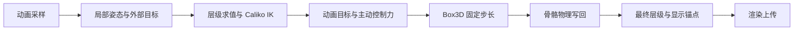

# 原生物理与姿态管线原理

通用刚体、场景、控制器、tick loop 和 Minecraft 接入见 [API reference](../api/physics.md)。

## 数据流与求值所有权

模型动画先写局部姿态，程序化模块与 IK 生成当前动画目标，原生物理推进动态刚体，
最后把物理结果写回骨骼并计算显示锚点。锚点必须跟随最终姿态，而不是动画阶段的中间结果。

物理拥有姿态时，动画目标求值承担本帧 IK 工作。物理写回后只重建层级，不能再求解 IK 或重新
应用原动画覆盖物理结果。目标可按骨骼输入变更 epoch 复用；同一物理步期间输入不变，不必为每个
fixed substep 重复构建整个动画层级。最终姿态版本供后续上传复用。

## 固定步长与原生能力

Box3D 负责积分、broad phase、窄相位、接触、关节、CCD 和休眠；Java 层只做对象映射、
固定时间步累计、生命周期与状态同步。单次更新限制追赶次数，超出的积累时间被丢弃，避免卡顿后
无限追赶。用于绘制的物理姿态在已完成状态之间插值。

原生库是可选能力，未提供平台库的分发仍可运行模型、动画和 IK，但不能推进原生物理。
这与 Java 备用求解器不同，库缺失时不会悄悄换用另一套物理行为。

## 刚体与关节

刚体可以由多个 body-local 子形状组成复合碰撞体。世界拥有原生对象，关闭世界释放整个对象集合；
动态对象的修改需要唤醒对应原生刚体。力在时间步内积分，冲量直接改变动量。
kinematic 体由动画驱动，dynamic 体反向写回骨骼；旋转专用写回保持动画平移。

球形、焊接、距离、转轴与滑动关节的约束均由原生引擎执行。作者六轴限制经过适配后可能近似为
cone/twist；固定锚点不等于完整支持作者的平移范围。原生引擎允许的柔性与限位误差也不同于数学刚性约束。

## 世界锚点与碰撞环境

double 世界锚点与局部 float 物理坐标分开，环境碰撞、射线和拖拽先转换到同一模拟坐标系。
世界移动或场景迁移需要同时重定位骨骼目标、刚体和环境，否则会引入错误的冲量或位置跳变。

Minecraft 方块物理从真实 VoxelShape 生成复合体，环境网格增量维护局部碰撞区。
方块更新驱动失效，周期刷新作为兜底；玩家通过 kinematic proxy 参与局部交互。
这套客户端局部模拟不提供服务器权威实体、存档或完整同步，也不扩展服务器的世界模拟范围。

## 主动布娃娃与边界

主动控制器将同帧动画/IK 目标转为受限 PD 弹簧力和力矩，仍由 Box3D 处理接触与关节。
控制器修改目标和施力，不能直接覆盖原生积分。物理不应因渲染视锥剔除而冻结。
一个世界只维护一个拖拽约束；流体浮力和逐顶点 PMX 软体仍未接入。
