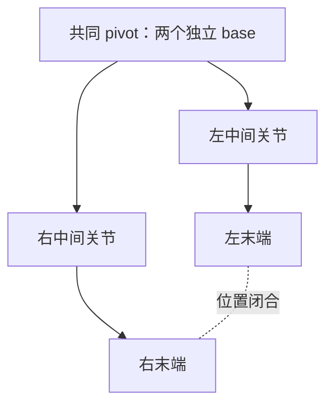

# 通用骨骼物理、IK 与闭环约束原理

构造方法、字段、校验、Reader/Builder 和运行时接口见 [API reference](../api/skeleton-dynamics.md)。

## 格式读取与共享定义

物理刚体、关节、IK 链及菱形闭环定义属于 Skeleton 的共享数据。格式 Reader 只在模型构建时
将作者数据转换为通用骨骼引用与求解设置；运行时不需要把 glTF 包装为 PMX 数据。
原始格式 metadata 仍可保留，用于完整格式访问，与通用运行时定义的所有权分开。

共享定义复制集合与向量，但骨骼对象本身仍是共同的结构引用。目标、启用开关、IK 修正和物理状态
属于各个模型实例，多个实例不会通过共享定义交换求解状态。骨骼到链的反向映射预先构建，
避免每个骨骼求值时扫描全部链。定义扩展应在实例创建前完成。

## 姿态与位置求解

骨骼层级先合成绑定姿态、morph 与动画局部变换，再把驱动骨和末端位置交给 Caliko 的 FABRIK。
库负责位置求解，适配层把解出的骨段方向逆向映射为局部旋转，并重新求值受影响的骨骼子树。

```text
当前世界方向 → 当前骨骼逆矩阵 → 局部方向
求解世界方向 → 当前骨骼逆矩阵 → 局部目标方向
两局部方向的最小旋转 → 叠加 IK 修正 → 重算层级
```

坐标逆变换避免把世界旋转直接当作骨骼局部旋转。锥形和铰链交给 Caliko，PMX 多轴 Euler
盒限位在局部修正上投影后重新求解，复杂盒限位不保证找到全部可行解。非均匀缩放、shear 和
平移动画还会改变有效段长，因此结果以真实层级写回后的末端残差为准。

每次从当前姿态构造输入，避免库仅根据不变 target/base 复用过期动画解。已经满足目标的链
保持原姿态，不另选弯曲解。MMD 的链可以接管作者局部姿态，避免 VMD 直接驱动链骨和 IK 双重旋转；
单骨脚趾方向目标则忽略控制器纯平移，保留脚趾朝向语义。

## 菱形闭环的表示

Skeleton 仍是单父节点树。闭环用两条独立分支表示：两个 base 在绑定位置共享 pivot，
两个末端表示同一个闭合点。典型四边形各分支有两个段，长度由绑定骨骼决定，
拓扑闭环本身不强制四边等长。



先以控制器目标的中点作为共同目标，将两分支分别交给 Caliko。限位或不可达造成不重合时，
取两者解的中点继续有限次数投影。分支共享驱动骨或层级相互嵌套会使一次写回覆盖另一分支，
因此构建时拒绝这些结构。

闭环残差同时计入末端间距和 base 间距。停止迭代不等于收敛，诊断需要保留 residual 与
satisfied。此闭环仅约束位置，不锁定末端姿态，也不向物理世界施加机械反馈关节。

## 物理写回与稳定初始条件

动画和 IK 先提供物理目标，动态刚体完成积分后替换相应局部姿态。写回后只重建最终层级，
不再求解 IK，避免修正物理结果。主体胶囊的等长子骨按稳定骨骼顺序选择，防止哈希遍历
改变骨盆朝向和落地初始条件。

六轴作者关节仍近似到 Box3D 球形 cone/twist，逐顶点软体仍未模拟。原生积分、浮动原点和
affine 层级写回见 [物理原理](physics.md) 与 [格式适配原理](mmd-ragdoll.md)。
