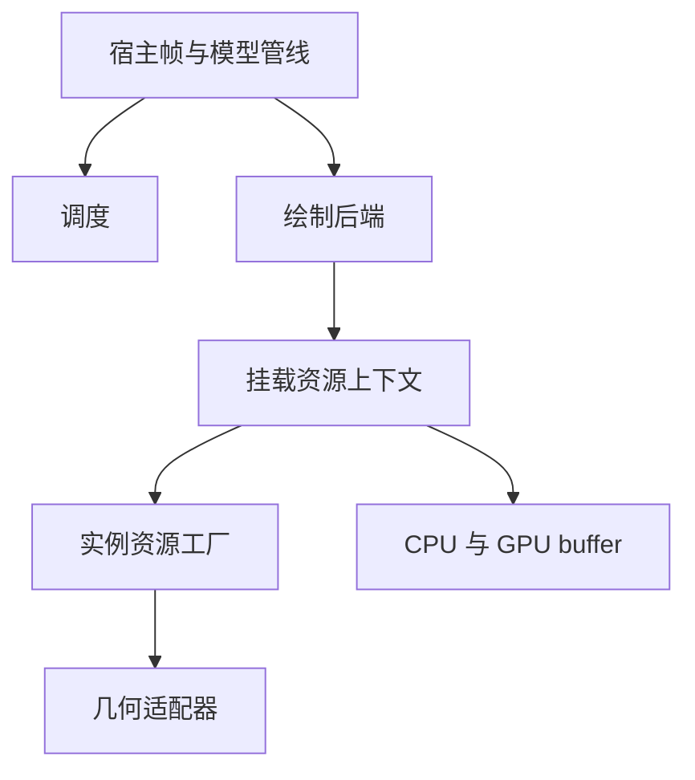

# UML 渲染框架与资源所有权原理

公共接口、泛型、生命周期规约和 buffer 接入见 [API reference](../api/uml-render-framework.md)。

## 层级职责

核心定义模型、骨骼、姿态、调度、资源上下文、buffer 与输出契约，不依赖 Minecraft 或具体图形 API。
宿主负责帧与视角入口，后端负责资源与绘制，几何适配器负责模型表示转换，资源工厂负责创建某实例的资源。
这些职责可组合，不能让几何转换同时管理共享 executor、帧标记和绘制管线。

挂载资源、宿主帧上下文与渲染前元数据是不同对象。后端显式向工厂提供服务，不要求适配器按字符串
反查后端。上下文缓存工厂创建的资源，但不拥有模型实例、共享适配器或 executor。

## 先准备，再发布

新挂载必须准备成功后才能发布。替换失败时关闭未发布的新上下文，并保留旧挂载；成功后发布新挂载
再释放旧资源。移除先从注册表解除，再关闭上下文；关闭整个后端尝试释放所有挂载并汇总异常。
关闭是幂等操作，已关闭上下文不能再次分配资源。共享视图只读，修改必须经过生命周期入口。

## 调度和采样分离

调度只决定策略可见性，后端依次执行距离与视锥门控。不同视角有自己的可见标记，同一帧共享
姿态采样缓存。物理推进独立于绘制可见性。具体帧时序见 [调度原理](render-scheduling.md)。

## buffer 与在途读取

CPU buffer 的索引以元素计，容量和步长以字节计，两者不能混用。短更新只覆盖前缀，保留尾部与容量；
切片借用原内存，不得超出关闭时刻。

GPU 上传接收完整快照，脏范围描述变更元素。环形槽位分别追踪版本与历史修改，在被再次使用时补齐
积累差异。GPU 在途读取期间不能覆盖 storage；设备可以替换存储，并以非阻塞完成查询判断回收。
每次 draw 和透明回放都记录消费，即使本帧数据未变化，也不能漏掉完成标记。

设备层拥有图形 API 操作和状态恢复，ring 拥有 buffer/fence 生命周期。macOS TBO 的 orphan 策略
属于 OpenGL 设备实现，不应进入平台无关的模型和调度层。模块边界见 [后端原理](rendering-backends.md)。
